# Phase 2 — Retrieval, explained simply

This page explains everything we built in Phase 2, one idea at a time, with everyday analogies. No prior knowledge of vector databases or Docker is assumed.

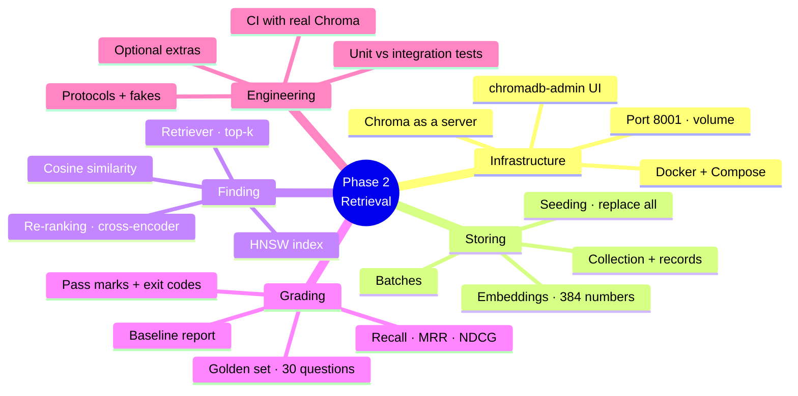

---

## 0. Where Phase 2 fits

Think of the whole project as a **library with a smart librarian**.

| Part | Library analogy | Phase |
|---|---|---|
| `data/raw/` | The books | — |
| Ingestion (load, chunk) | Cutting books into index cards | 1 |
| Embeddings | Writing a "meaning code" on every card | 1 |
| **Vector database (Chroma)** | **The filing cabinet that holds all cards, sorted by meaning** | **2** |
| **Retriever** | **The librarian who finds the right cards for a question** | **2** |
| **Re-ranker** | **A senior librarian who double-checks the shortlist** | **2** |
| **Evaluator** | **The exam that grades the librarian** | **2** |
| Generation (LLM) | Writing the answer from the cards | 3 (next) |

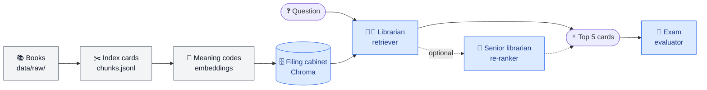

Grey = Phase 1, blue = built in Phase 2.

After Phase 1 we had index cards (`data/processed/chunks.jsonl`). In Phase 2 we built the **filing cabinet**, the **librarian**, and the **exam** — and got the first real grades.

The full flow now works with three commands:

```bash
uv run python scripts/run_ingestion.py       # 1. cut books into cards        (Phase 1)
uv run python scripts/seed_vector_store.py   # 2. put cards into the cabinet  (Phase 2)
uv run python scripts/run_evaluation.py      # 3. give the librarian the exam (Phase 2)
```

---

## 1. Docker — "a ready-to-use appliance"

### The problem
To use Chroma, you would normally install it, its database engine, and the right versions of everything on your Mac. Your teammate does the same on Windows, and GitHub does it on Linux. Small differences break things: *"works on my machine"*.

### The analogy
Docker is like buying a **sealed microwave**. You don't build a microwave from parts; you plug it in and it works the same in every kitchen.

| Docker word | Meaning | Analogy |
|---|---|---|
| **Image** | A packaged app with everything it needs (`chromadb/chroma:1.5.9`) | The microwave in its box, from the factory |
| **Container** | A running copy of an image | The microwave plugged in and switched on |
| **Volume** | Storage that survives restarts (`chroma-data`) | A fridge next to the microwave — food stays even if you unplug the microwave |
| **Port mapping** (`8001:8000`) | Connects a port on your Mac to a port inside the container | The container's door is number 8000 inside the building; from the street you knock on door 8001 |
| **Healthcheck** | Docker asks the app "are you OK?" every few seconds | The microwave's little green "ready" light |

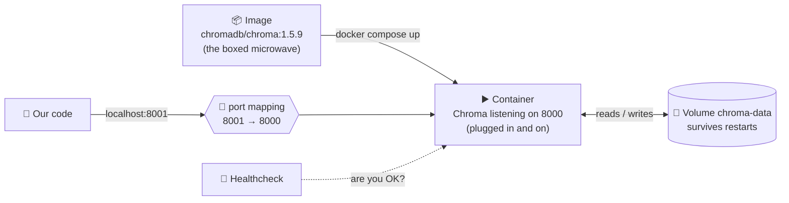

### Docker Compose
Starting containers one by one with long commands is tedious. **Docker Compose** lets us describe all our "appliances" in one file — [docker/docker-compose.yml](../../docker/docker-compose.yml) — and start them together:

```bash
docker compose -f docker/docker-compose.yml up -d     # switch on
docker compose -f docker/docker-compose.yml down      # switch off (data kept in the volume)
docker compose -f docker/docker-compose.yml down -v   # switch off AND delete the data
```

`-d` means "run in the background" so your terminal stays free.

The life of our Chroma container:

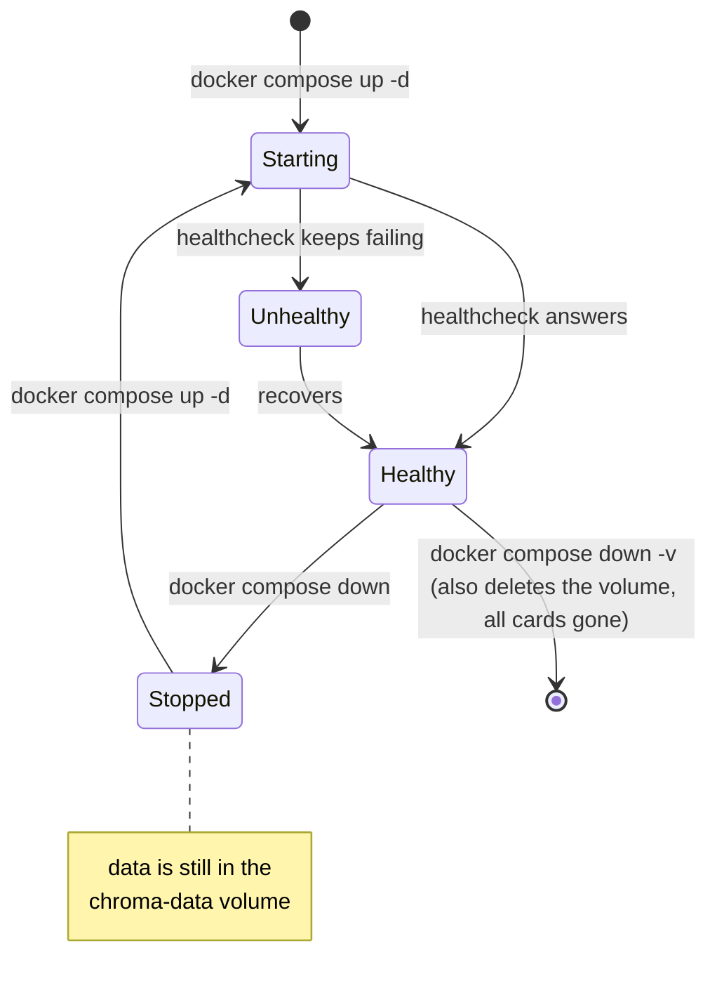

### Three decisions we made
1. **Port 8001, not 8000.** Chroma listens on 8000 inside the container, but we expose it as **8001** on your Mac, because port 8000 is where our own API (FastAPI) will live later. Two shops can't share one door.
2. **Pinned version `1.5.9`.** The Docker image and the Python client (`chromadb-client==1.5.9`) must speak the same "language". Like a phone charger — the plug must match the socket.
3. **`127.0.0.1` only.** The ports are only reachable from your own computer, not from other devices on your Wi-Fi.

### Profiles — optional appliances
The admin UI (section 12) is defined with `profiles: ["ui"]`. That means it **only starts when you ask for it**:

```bash
docker compose -f docker/docker-compose.yml --profile ui up -d
```

Like a dishwasher you only switch on when needed.

---

## 2. Chroma as a server — "calling the warehouse"

Chroma can run in two ways:

| Mode | How it works | Analogy |
|---|---|---|
| Embedded | Chroma lives *inside* your Python program | Keeping all stock in your own backpack |
| **Server (what we use)** | Chroma runs in its own container; our code talks to it over the network (HTTP) | Calling a **warehouse** by phone: "store these boxes", "find me boxes like this one" |

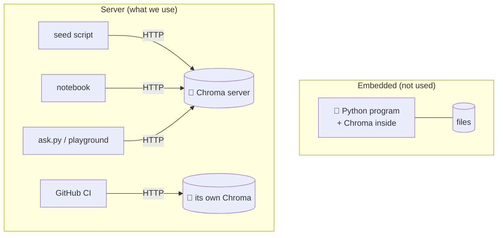

We chose **server mode** because:
- It is how real companies run it (the app and the database are separate).
- The script that fills the database and the notebook that reads it can run at different times and still see the same data.
- CI can start the same Chroma container and test against it.

Our code makes the "phone call" with the **client**:

```python
client = chromadb.HttpClient(host="localhost", port=8001)
```

The host and port come from settings (`RAG_CHROMA_HOST`, `RAG_CHROMA_PORT`), never hard-coded — so CI can point to its own Chroma without changing code.

If the warehouse doesn't answer, we don't show a scary stack trace; we show a helpful message:

> Cannot reach Chroma at localhost:8001. Is it running? Start it with: `docker compose -f docker/docker-compose.yml up -d`

---

## 3. What is stored in Chroma — "the index card cabinet"

Inside Chroma, data lives in a **collection** (ours is called `rag_documents`). A collection is like **one drawer** of the filing cabinet.

Each **record** (one index card) has four parts:

| Part | Our value | Analogy |
|---|---|---|
| **id** | `retrieval_metrics.md#2` | The card's unique number |
| **document** | The chunk text | What's written on the card |
| **embedding** | 384 numbers | The "meaning code" used for sorting |
| **metadata** | `doc_id`, `index`, `start_index`, `page` | Sticky notes: which book, which position, which page |

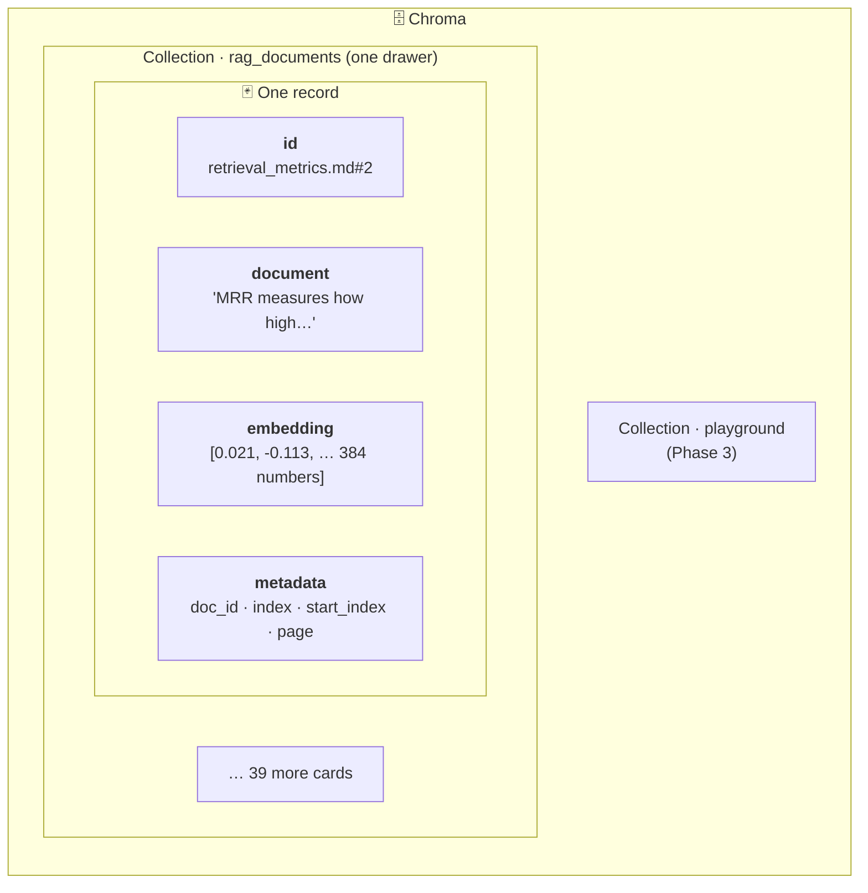

The metadata is important: when the librarian hands you a card, you can see **which book** it came from — that's what the exam grades, and later what citations will point to (`[1] → retrieval_metrics.md`, page 2 for PDFs).

How all the pieces of data relate, from a book to a stored card to the exam that checks it (an **entity-relationship diagram**: `||--|{` reads "one … to one or more"):

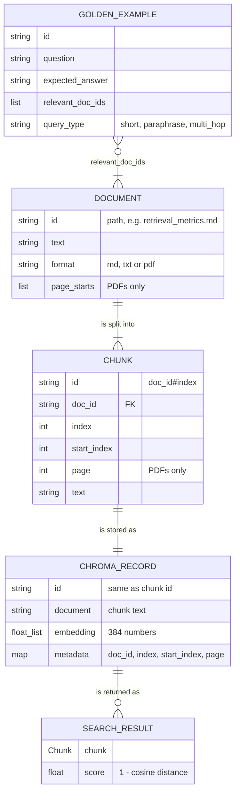

The exam's link goes to **documents**, not chunks: that is why the golden set stays valid when chunk size changes.

One small gotcha we handled: **Chroma does not allow empty (`None`) metadata values.** Markdown chunks have no page number, so we simply *leave out* the `page` sticky note for them, and put it back as `None` when reading.

---

## 4. Similarity — "arrows pointing in the same direction"

How does Chroma know which cards are "close" to a question?

Imagine every text is an **arrow** pointing somewhere in space. Texts with similar meaning point in **similar directions**.

- "What is Newton's second law?" → ↗
- "Force equals mass times acceleration." → ↗ (almost the same direction)
- "The Eiffel Tower is in Paris." → ← (very different direction)

A picture of this "meaning space", squeezed into 2 dimensions (the real one has 384):


Points that sit close together have similar meaning; the question lands right next to the card that answers it.

**Cosine similarity** measures the angle between two arrows:

| Angle | Cosine similarity | Meaning |
|---|---|---|
| Same direction | **1.0** | Same meaning |
| 90° apart | 0.0 | Unrelated |
| Opposite | -1.0 | Opposite |

Chroma reports **distance**, not similarity. For cosine they're mirror images:

```
distance = 1 − similarity        →        similarity = 1 − distance
```

So in our code the score we return is `1.0 - distance`, where **higher = more relevant**. That's easier to read.

**Why "normalised" vectors matter:** our embedder makes every arrow exactly length 1. Then cosine similarity is simply multiplying the numbers and adding them up (the "dot product") — fast and simple. You can see this in the notebook: the vector length prints as `1.0`.

**How is search fast?** Chroma doesn't compare your question with every card one by one. It uses an index called **HNSW** — like a city's road map with highways and local streets: jump along the highways to the right neighbourhood, then walk the local streets to the exact house. We don't write this; Chroma does it for us.

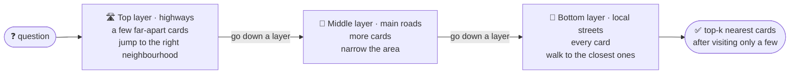

We only tell it to use cosine:

```python
configuration = {"hnsw": {"space": "cosine"}}
```

---

## 5. Seeding — "stocking the shelves"

**Seeding** means filling the vector database with our chunks. It's done by [retrieval/seed.py](../../src/rag_eval_platform/retrieval/seed.py), run through `scripts/seed_vector_store.py`:

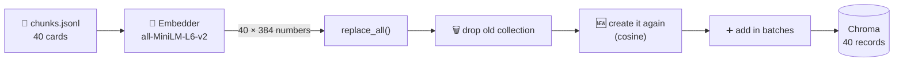

### Why "replace all" instead of "add"?
Every time we seed, we **delete the whole collection and create it fresh** (`replace_all`).

Analogy: when a shop gets a **new catalogue**, it doesn't paste new pages into the old one — the old one might contain products that no longer exist. It throws the old catalogue away and prints a new one.

If we only *added*, then after changing chunk size from 800 to 500, the drawer would contain **both** old and new cards. Search results would be a mess, and the scores would be meaningless.

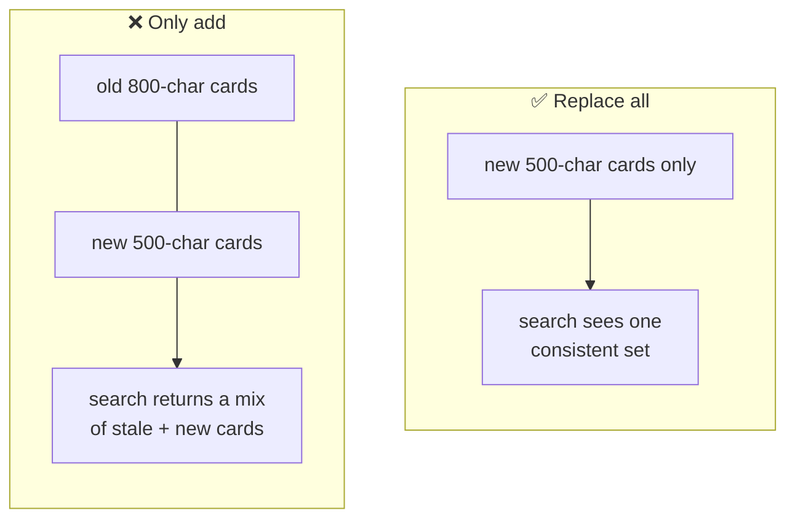

**Rule:** re-run seeding after changing chunking or the embedding model.

### Batches — "moving boxes"
Chroma accepts a limited number of records per request (on our server: 5,461). Like carrying boxes to a moving truck — you can't carry 10,000 at once, so you carry them in trips. Our code asks Chroma for its limit and sends the chunks in batches of that size. With 40 chunks it's one trip, but a big physics library would need many.

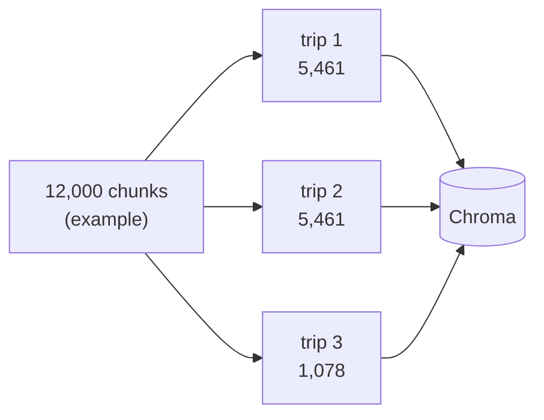

### The hand-off file
`chunks.jsonl` sits between ingestion and seeding, like a **delivery note** between two departments. Ingestion writes it; seeding reads it. That means you can re-seed (for example, with a different embedding model) without re-reading all the PDFs.

---

## 6. The retriever — "the librarian"

[retrieval/retriever.py](../../src/rag_eval_platform/retrieval/retriever.py) is short, and that's the point. It only coordinates:

```python
query_embedding = self.embedder.embed_query(query)  # 1. turn the question into an arrow
if self.reranker is None:
    return self.store.search(query_embedding, k=self.top_k)  # 2. fetch the 5 closest cards

candidates = self.store.search(query_embedding, k=20)  # 2b. fetch 20 candidates
return self.reranker.rerank(query, candidates, top_n=5)  # 3. senior librarian picks the best 5
```

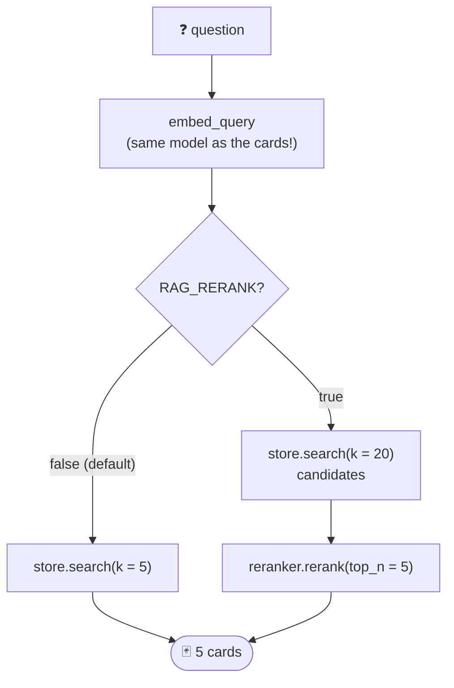

Important rule: the question must be embedded with **the same model** as the chunks. Otherwise it's like asking for a book using the Dewey system in a library sorted alphabetically — the "codes" don't match.

**top-k** is how many cards the librarian brings back (default 5, setting `RAG_TOP_K`). More cards = better chance the answer is among them (higher recall), but more noise and a longer, costlier prompt for the LLM later.

---

## 7. Re-ranking — "shortlist, then interview"

### Two kinds of models

| | Bi-encoder (our embedder) | Cross-encoder (our re-ranker) |
|---|---|---|
| How it works | Reads the question and each card **separately**, compares arrows | Reads the question and one card **together**, gives a relevance score |
| Speed | Very fast (cards were encoded in advance) | Slow (must run once per question–card pair) |
| Accuracy | Good | Better |
| Analogy | **Screening CVs by keywords** | **A face-to-face interview** |

You can't interview every applicant in the country — too slow. But you also don't want to hire based on keywords alone. So you do both:

1. **Screen** — the vector search picks the 20 most promising cards (fast).
2. **Interview** — the cross-encoder reads each of the 20 carefully with the question and picks the best 5 (slow, but only 20 times).

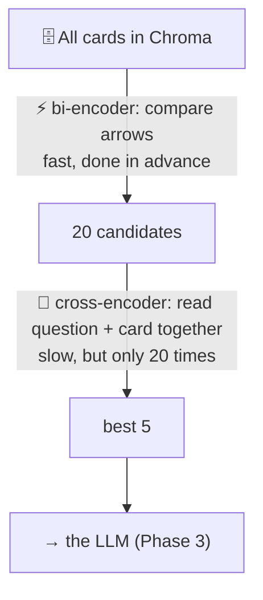

The same funnel as a **flow**: where the 40 cards of the sample corpus go for one question.

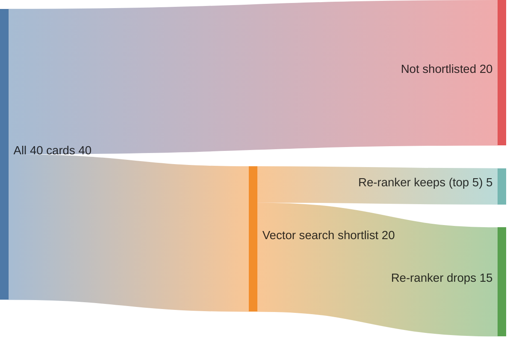

That's `rerank_candidates=20` and `top_k=5`. Turn it on with `RAG_RERANK=true`. The model is `cross-encoder/ms-marco-MiniLM-L-6-v2`, downloaded from Hugging Face on first use.

### What it did for us (notebook section 7)

| | Recall (before → after) | MRR | NDCG |
|---|---|---|---|
| Overall | 0.933 → **0.950** | 0.878 → **0.928** | 0.876 → **0.929** |
| multi_hop | 0.667 → **0.917** | 0.750 → 0.806 | 0.646 → 0.813 |
| short | 1.000 → **0.938** | 0.896 → 0.938 | 0.923 → 0.938 |

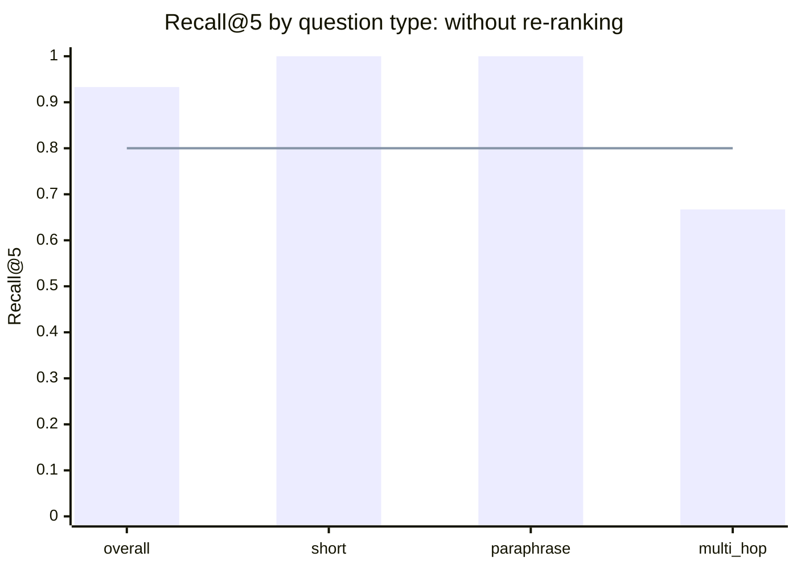

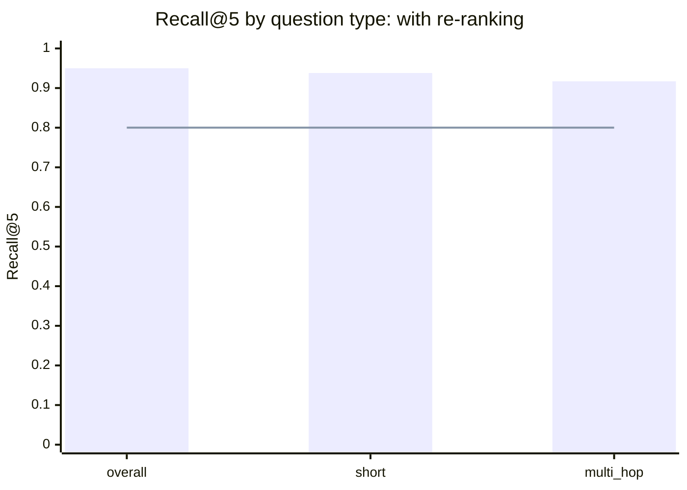

The line is the 0.80 pass mark. Multi-hop jumps from well below it to comfortably above it.

Re-ranking **fixed most multi-hop misses** but **lost one short question**. Nothing is free: this is a trade-off, and without the exam we would never have seen it. Re-ranking is still **off by default** until we decide, with numbers, that the trade is worth it (plus it adds latency).

---

## 8. Interfaces and fakes — "standard plug sockets"

Our code never says "use Chroma" deep inside business logic. It says "use *something that behaves like a vector store*". That "shape" is a **Protocol**:

```python
class VectorStore(Protocol):
    def replace_all(self, chunks, embeddings) -> None: ...
    def search(self, query_embedding, k) -> list[SearchResult]: ...
    def count(self) -> int: ...
```

Analogy: a **wall socket**. The socket doesn't care if you plug in a lamp, a laptop or a kettle — anything with the right plug works.

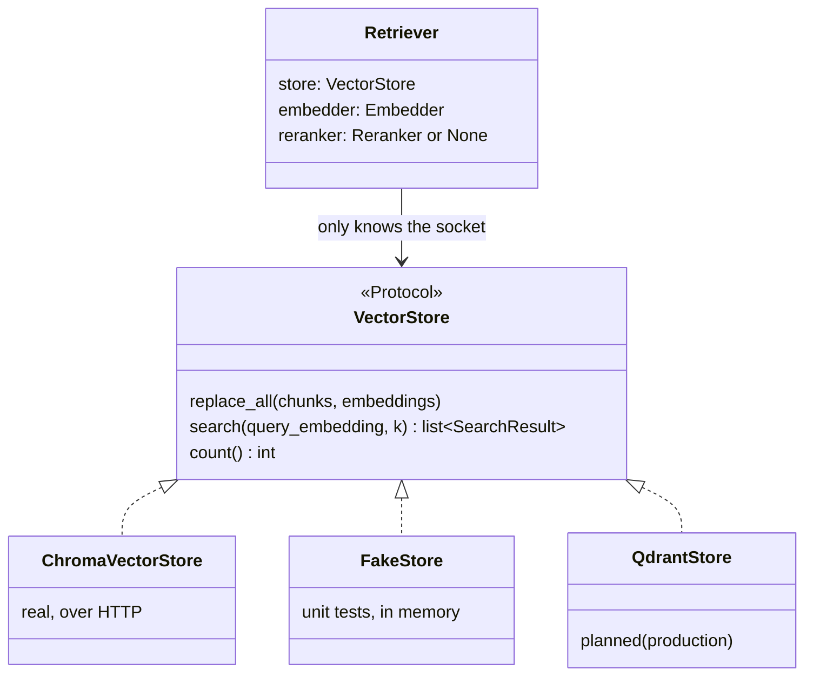

That gives us two superpowers:
1. **Swap backends** — Qdrant can be added later as another "plug" without touching the retriever.
2. **Fast, reliable tests** — in unit tests we plug in a **fake** store and a **fake** embedder (tiny pretend versions written in the test file). No Docker, no model download, tests run in about a second.

We have the same pattern for `Embedder` and `Reranker`.

---

## 9. Two kinds of tests — "flight simulator vs test flight"

| | Unit tests (`tests/unit/`) | Integration tests (`tests/integration/`) |
|---|---|---|
| Uses | Fakes | **Real** Chroma in Docker, **real** models |
| Speed | ~1 second | Slower (network, model loading) |
| Analogy | **Flight simulator** — practise every emergency safely | **Test flight** — prove the real plane flies |
| Marked | — | `@pytest.mark.integration` |

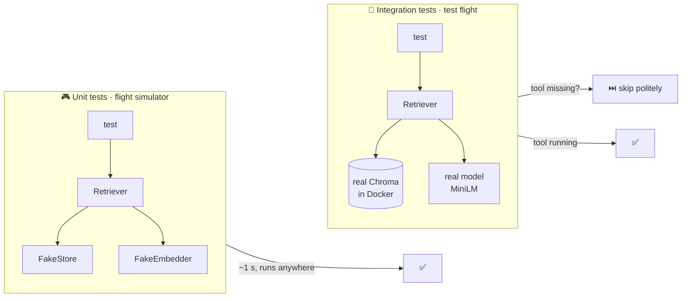

Integration tests **skip politely** when their tool isn't available (for example, Docker not running, or the model package not installed) instead of failing. You saw this: "5 skipped" when Docker was off.

```bash
uv run pytest tests/unit          # simulator
uv run pytest -m integration      # test flight (start Docker first)
```

---

## 10. Optional dependencies — "a toolbox with extra drawers"

PyTorch (needed by the embedding model and the re-ranker) is huge. The CI unit tests don't need it, because they use fakes. So it lives in an **optional extra**:

```bash
uv sync                      # basic toolbox
uv sync --all-extras         # + the heavy drawer (PyTorch, models, OpenAI)
uv sync --all-extras --group notebook   # + Jupyter and pandas
```

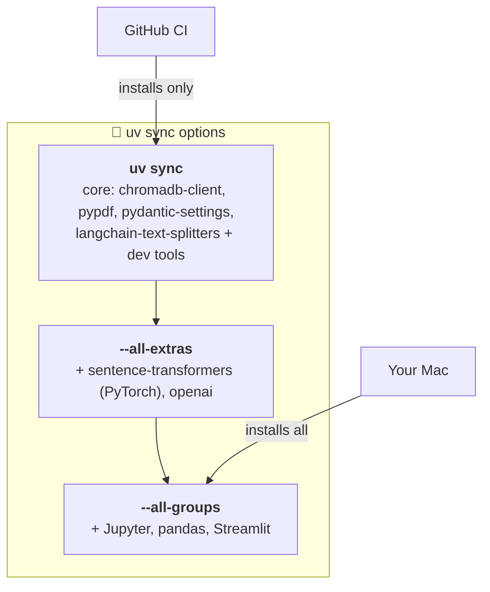

If code needs a tool from a drawer you didn't open, you get a friendly message instead of a crash:

> The 'sentence_transformers' package is not installed. Run: uv sync --extra local-embeddings

That message comes from one small shared helper, [_optional.py](../../src/rag_eval_platform/_optional.py). The embedder and the re-ranker both use it — written **once**, not copied (the DRY rule: *Don't Repeat Yourself*).

---

## 11. The evaluator — "the exam and the report card"

[evaluation/evaluator.py](../../src/rag_eval_platform/evaluation/evaluator.py) gives the librarian the 30-question exam:

1. For each golden question → ask the retriever.
2. Turn the returned cards into **book names** (`retrieval_metrics.md#2` → `retrieval_metrics.md`), and remove repeats — two cards from the same book count once.
3. Grade with the metrics from `metrics.py` (Recall, MRR, NDCG, Precision).
4. Average: overall **and per question type** (short, paraphrase, multi-hop).
5. Compare with the **pass marks** from settings.

```mermaid
flowchart LR
    G["📋 Golden set<br/>30 questions +<br/>correct books"] --> R["🧑‍💼 Retriever"]
    R --> CK["🃏 chunk ids<br/>metrics.md#2, metrics.md#0, rag.md#1"]
    CK --> DOC["📚 book ids, repeats removed<br/>metrics.md, rag.md"]
    DOC --> M["📐 Recall · MRR · NDCG · Precision<br/>per question"]
    M --> AVG["📊 averages<br/>overall + per type"]
    AVG --> TH{"≥ pass marks?"}
    TH --> REP["📝 reports/retrieval_report.json"]
```

### Pass marks (thresholds)
| Metric | Minimum |
|---|---|
| Recall@k | 0.80 |
| MRR | 0.70 |
| NDCG@k | 0.70 |

They live in settings, not in code, so changing a pass mark is a visible, reviewed decision.

### Exit codes — a traffic light
The command ends with a number that other programs (like CI) can read:

| Exit code | Meaning | Light |
|---|---|---|
| **0** | All pass marks met | 🟢 |
| **1** | A metric is below its pass mark | 🔴 quality problem |
| **2** | Couldn't run at all (Chroma down, dataset missing…) | 🟡 setup problem |

```mermaid
flowchart TD
    RUN["run_evaluation.py"] --> CAN{"Could it run?<br/>Chroma up, dataset valid…"}
    CAN -->|no| E2["🟡 exit 2<br/>setup problem"]
    CAN -->|yes| PASS{"Every metric ≥<br/>its pass mark?"}
    PASS -->|yes| E0["🟢 exit 0<br/>all good"]
    PASS -->|no| E1["🔴 exit 1<br/>quality problem"]

    classDef g fill:#dcfce7,stroke:#16a34a,color:#14532d
    classDef r fill:#fee2e2,stroke:#dc2626,color:#7f1d1d
    classDef y fill:#fef3c7,stroke:#d97706,color:#78350f
    class E0 g
    class E1 r
    class E2 y
```

Separating 1 from 2 matters: "the librarian failed the exam" and "the exam room was locked" need different fixes.

It also writes the full report to `reports/retrieval_report.json` (ignored by git — it's regenerated every run).

### Our first grades (baseline)

```
metric         score    min
recall@k       0.933   0.80  PASS
mrr            0.878   0.70  PASS
ndcg@k         0.876   0.70  PASS
precision@k    0.327      -
```

```mermaid
xychart-beta
    title "Baseline scores vs pass marks"
    x-axis ["Recall@5", "MRR", "NDCG@5"]
    y-axis "Score" 0 --> 1
    bar [0.933, 0.878, 0.876]
    line [0.8, 0.7, 0.7]
```

Bars are our scores; the line is the pass mark. (Precision@5, 0.327, has no pass mark; see below why it's low.)

How to read them:
- **Recall 0.933** — for 93% of the needed books, the librarian brought them within the top 5.
- **MRR 0.878** — the first correct book is usually at rank 1.
- **Precision 0.327 looks low, but it's expected.** Most questions have only **one** correct book, and the librarian brings up to 5 different books. Even perfect retrieval would score about 1 in 3 here. Low precision just means "extra cards", not "wrong answers".
- **The per-type table is the real insight:** multi-hop questions (needing two books) had recall 0.667 — the librarian found one of the two books but not the other. An average alone would have hidden that.

This baseline is recorded in [evaluation_methodology.md](../evaluation_methodology.md). Every future change (chunk size, model, re-ranking) is compared against it.

---

## 12. Looking inside — admin UI and notebook

### chromadb-admin — "a window into the warehouse"
A small community web app, running as another Docker container:

```bash
docker compose -f docker/docker-compose.yml --profile ui up -d
```

Open http://localhost:3001 and connect to **`http://chroma:8000`**.

Why `chroma:8000` and not `localhost:8001`? The admin UI runs **inside** Docker, next to Chroma. Inside Docker's private network, containers call each other by **service name** and **inner port** — like colleagues in the same office using internal extension numbers instead of the public phone number.

```mermaid
flowchart LR
    subgraph mac["💻 Your Mac"]
        BR["🌐 Browser"]
        PY["🐍 Our code"]
        subgraph net["🐳 Docker private network"]
            AD["chromadb-admin<br/>:3001 inside"]
            CH[("chroma<br/>:8000 inside")]
            AD -->|"http://chroma:8000<br/>internal extension"| CH
        end
    end
    BR -->|"localhost:3001"| AD
    PY -->|"localhost:8001<br/>public number"| CH
```

It's great for **browsing** cards and sticky notes. Its search box only looks up a card **by id**, not by meaning.

### The notebook — "a lab bench"
[notebooks/exploration.ipynb](../../notebooks/exploration.ipynb) is where you **experiment**: see all chunks as a table, read one book card by card, look at an embedding, ask any question, list the misses, and compare re-ranking on/off. It uses the project's own retriever, so what you see is exactly what the evaluation sees.

In VS Code, the notebook must use the project's **`.venv` kernel** (top-right kernel picker). Other Pythons on your Mac don't have `chromadb` installed — that was the `ModuleNotFoundError` you saw. `.vscode/settings.json` now points VS Code at `.venv` by default.

---

## 13. CI with a real database — "a temporary test kitchen"

On every push, GitHub now runs a third job: **Integration tests (Chroma in Docker)**. It uses a **service container** — GitHub starts the same `chromadb/chroma:1.5.9` image next to the tests, waits until it answers the heartbeat, runs `pytest -m integration`, and throws the kitchen away afterwards.

The model tests skip there (no PyTorch in CI, on purpose), but the Chroma tests run against a real database every time.

```mermaid
sequenceDiagram
    participant GH as GitHub push
    participant R as CI runner
    participant C as Chroma service container
    GH->>R: start "Integration tests" job
    R->>C: start chromadb/chroma:1.5.9
    R->>R: uv sync --locked
    loop until it answers
        R->>C: heartbeat?
        C-->>R: ok
    end
    R->>C: pytest -m integration
    C-->>R: ✅ Chroma tests pass
    Note over R: model tests ⏭️ skip (no PyTorch)
    R->>C: remove container 🧹
```

| CI job | Checks |
|---|---|
| Lint, type-check and test | Code style, types, unit tests |
| **Integration tests (Chroma in Docker)** | Our code really works with a real Chroma |
| Secret scan | No keys or passwords were committed |

---

## 14. Quieter logs — "turning down the background music"

When we first ran seeding, the output was flooded with lines like `HTTP Request: HEAD https://huggingface.co/...` — the libraries narrating every tiny step. Our own useful message was buried at the bottom.

`configure_logging()` now sets these chatty libraries (`httpx`, `huggingface_hub`, `sentence_transformers`, `chromadb`, …) to **WARNING**: they still speak up when something is wrong, but stay quiet otherwise. Now seeding prints one clear line:

```mermaid
flowchart LR
    subgraph libs["📢 Chatty libraries → WARNING"]
        L1["httpx"] ~~~ L2["huggingface_hub"] ~~~ L3["chromadb"]
    end
    subgraph ours["🗣️ Our code → INFO"]
        O["rag_eval_platform"]
    end
    libs -->|"only problems"| OUT["🖥️ terminal<br/>one JSON line per event"]
    ours -->|"every useful step"| OUT
```


```json
{"level": "INFO", "message": "Vector store seeded", "chunks": 40, "collection": "rag_documents", ...}
```

---

# Part B — The code, file by file

Part A explained the *ideas*. Part B walks through the *Python* we wrote, in the order the data travels. For each file: what it is for, the important lines, and the Python tricks it uses.

```mermaid
flowchart LR
    subgraph helpers["🧩 Helpers every file uses"]
        OPT["_optional.py"] ~~~ SET["settings.py"] ~~~ LOG["logging_config.py"]
    end
    J["📄 chunks.jsonl"] --> SEED["seed.py"] --> VS["vector_store.py"]
    CLI["evaluation/cli.py"] --> EV["evaluator.py"] --> RET["retriever.py"]
    RET --> VS
    RET -.-> RR["reranker.py"]
    VS --> CH[("Chroma")]
```

Arrows mean "uses": seeding writes into the vector store, and the evaluator reads from it through the retriever.

Links like [vector_store.py:66-90](../../src/rag_eval_platform/retrieval/vector_store.py#L66-L90) open the exact lines.

---

## B1. `_optional.py` — the friendly import helper

[src/rag_eval_platform/_optional.py](../../src/rag_eval_platform/_optional.py)

```python
class OptionalDependencyError(ImportError):
    """A package from an optional extra (see pyproject.toml) is not installed."""


def import_optional(module_name: str, extra: str) -> Any:
    try:
        return import_module(module_name)
    except ModuleNotFoundError as exc:
        raise OptionalDependencyError(
            f"The '{module_name}' package is not installed. Run: uv sync --extra {extra}"
        ) from exc
```

**What it does:** imports a package *by its name as text* (`"sentence_transformers"`). If it is missing, it raises our own error that tells you the exact command to fix it.

**Python ideas**
- `import_module("x")` is the same as `import x`, but done at run time. We import heavy packages **only when they are really needed** ("lazy import"), so the rest of the program starts fast and works without PyTorch.
- `class OptionalDependencyError(ImportError)` — our own error type that *is also* an `ImportError`. Code that catches `ImportError` still catches it.
- `raise ... from exc` keeps the original error attached ("caused by …"), so debugging still shows the real root cause.

---

## B2. Settings and logging — two small changes

**[settings.py:48-50](../../src/rag_eval_platform/config/settings.py#L48-L50)** — the old `chroma_path` (a folder) became a host and port, because Chroma is now a server:

```python
chroma_host: str = "localhost"
chroma_port: int = Field(default=8001, gt=0, le=65535)
```

`Field(gt=0, le=65535)` is a rule: a port must be 1–65535. Set `RAG_CHROMA_PORT=99999` and the program refuses to start — mistakes are caught early.

**[logging_config.py](../../src/rag_eval_platform/config/logging_config.py)** — the "turn down the background music" change:

```python
NOISY_LOGGERS = ("httpx", "httpcore", "huggingface_hub", "sentence_transformers", "chromadb")
...
for name in NOISY_LOGGERS:
    logging.getLogger(name).setLevel(max(numeric_level, logging.WARNING))
```

Every library has its own named logger. We raise their level to at least `WARNING`. `max(...)` means: if *you* ask for `ERROR`, they get `ERROR` too — they are never *louder* than you.

---

## B3. `vector_store.py` — the filing cabinet

[src/rag_eval_platform/retrieval/vector_store.py](../../src/rag_eval_platform/retrieval/vector_store.py) is the biggest Phase 2 file. It has five parts.

### Part 1 — the result box

```python
@dataclass(frozen=True)
class SearchResult:
    chunk: Chunk
    score: float
```

A tiny container: "this card, with this relevance score".
- `@dataclass` writes the boring code for us (`__init__`, `==`, a readable print).
- `frozen=True` makes it **read-only** after creation. Nobody can accidentally change a score later — this is the project's *immutability* rule.

### Part 2 — the socket shape

```python
class VectorStore(Protocol):
    def replace_all(
        self, chunks: Sequence[Chunk], embeddings: Sequence[Sequence[float]]
    ) -> None: ...
    def search(self, query_embedding: Sequence[float], k: int) -> list[SearchResult]: ...
    def count(self) -> int: ...
```

A `Protocol` lists the methods something must have. The `...` means "no body here — this is only the shape". Any class with these three methods fits, **without inheriting** from `VectorStore`. That's how our test fakes fit too (Part A, section 8).

`Sequence[float]` means "anything list-like of floats" (a list, a tuple…), which is more flexible than demanding exactly a `list`.

### Part 3 — connecting: `connect()`

[vector_store.py:55-64](../../src/rag_eval_platform/retrieval/vector_store.py#L55-L64)

```python
@classmethod
def connect(cls, host: str, port: int, collection_name: str) -> Self:
    try:
        client = chromadb.HttpClient(host=host, port=port)
    except Exception as exc:
        raise VectorStoreError(
            f"Cannot reach Chroma at {host}:{port}. Is it running? "
            "Start it with: docker compose -f docker/docker-compose.yml up -d"
        ) from exc
    return cls(client, collection_name)
```

- `@classmethod` is a "second front door" for building the object. `ChromaVectorStore(client, name)` needs a ready client; `ChromaVectorStore.connect(host, port, name)` creates the client for you. `cls` means "this class", and `-> Self` means "returns an object of this class".
- Why two doors? **Tests** use the first door with a fake client; **real code** uses `connect`.
- We catch the broad `Exception` here **on purpose and only here**: when Chroma is down, its client raises different error types (we saw a plain `ValueError`). We translate all of them into one clear `VectorStoreError` with the fix in the message.

### Part 4 — storing: `replace_all()`

[vector_store.py:66-90](../../src/rag_eval_platform/retrieval/vector_store.py#L66-L90)

```python
if len(chunks) != len(embeddings):
    raise ValueError("chunks and embeddings must have the same length")

with suppress(NotFoundError):
    self._client.delete_collection(self._collection_name)
collection = self._client.create_collection(
    self._collection_name,
    configuration={"hnsw": {"space": "cosine"}},
    embedding_function=None,
)
```

Step by step:
1. **Safety check** — 40 cards need exactly 40 meaning codes. A mismatch would silently attach the wrong vector to a card.
2. **Throw away the old catalogue.** `suppress(NotFoundError)` means "if the collection doesn't exist yet, that's fine — carry on". It's a shorter way to write `try: ... except NotFoundError: pass`.
3. **Create it fresh** with cosine distance. `embedding_function=None` tells Chroma "don't compute embeddings yourself — we bring our own". Otherwise Chroma would try to use its own default model.

Then the batches:

```python
batch_size = self._client.get_max_batch_size()
for start in range(0, len(chunks), batch_size):
    batch = chunks[start : start + batch_size]
    ...
    collection.upsert(
        ids=[c.id for c in batch],
        embeddings=batch_embeddings,
        documents=[c.text for c in batch],
        metadatas=[_to_metadata(c) for c in batch],
    )
```

- `range(0, len(chunks), batch_size)` gives the starting position of every "trip": `0, 5461, 10922, …`.
- `chunks[start : start + batch_size]` is **slicing** — cut out one trip's worth of boxes.
- `[c.id for c in batch]` is a **list comprehension** — "make a list of the id of every chunk in this batch".
- `upsert` = **up**date or in**sert**: add a record, or replace it if the id already exists.

### Part 5 — searching: `search()` and the two converters

[vector_store.py:92-108](../../src/rag_eval_platform/retrieval/vector_store.py#L92-L108)

```python
if k < 1:
    raise ValueError(f"k must be >= 1, got {k}")
collection = self._collection()
if collection is None or collection.count() == 0:
    raise VectorStoreError("... is empty. Run: uv run python scripts/seed_vector_store.py")

response = collection.query(
    query_embeddings=query_embeddings,
    n_results=k,
    include=["documents", "metadatas", "distances"],
)
return _to_results(response)
```

It **checks first, then works** ("fail fast"): a bad `k`, or an empty cabinet, gives a clear message instead of a confusing empty answer. Note the message tells you *what to run*.

The two helper functions start with `_` — a Python convention for "private: only used inside this file".

**`_to_metadata`** ([lines 130-138](../../src/rag_eval_platform/retrieval/vector_store.py#L130-L138)) turns our `Chunk` into Chroma's sticky notes — and skips `page` when it is `None`, because Chroma rejects `None`.

**`_to_results`** ([lines 141-165](../../src/rag_eval_platform/retrieval/vector_store.py#L141-L165)) does the reverse. Chroma answers with **parallel lists**, one per field:

```python
{
    "ids": [["a#0", "b#0"]],
    "documents": [["text a", "text b"]],
    "metadatas": [[{...}, {...}]],
    "distances": [[0.006, 0.889]],
}
```

(The extra `[0]` is because Chroma can answer several questions at once; we always ask one.)

```python
rows = zip(
    response["ids"][0],
    response["documents"][0],
    response["metadatas"][0],
    response["distances"][0],
    strict=True,
)
```

`zip` walks the four lists **side by side**, like reading four columns of a table one row at a time. `strict=True` raises an error if the lists have different lengths, instead of silently dropping rows.

For each row it rebuilds a `Chunk` and sets `score=1.0 - float(distance)` — the similarity from Part A, section 4. If Chroma ever answers in an unexpected shape, the `except (KeyError, IndexError, TypeError, ValueError)` turns the crash into one clear `VectorStoreError`.

### The factory: `create_vector_store()`

```python
def create_vector_store(settings: Settings) -> VectorStore:
    if settings.vector_store == "qdrant":
        raise NotImplementedError("qdrant vector store is not implemented yet")
    return ChromaVectorStore.connect(
        settings.chroma_host, settings.chroma_port, settings.collection_name
    )
```

A **factory** is a function that reads the settings and builds the right object. The rest of the code just calls `create_vector_store(settings)` and never needs to know *which* database it got. Notice the return type is the Protocol `VectorStore`, not `ChromaVectorStore`.

---

## B4. `seed.py` — stocking the shelves

[src/rag_eval_platform/retrieval/seed.py](../../src/rag_eval_platform/retrieval/seed.py)

It has two functions with different jobs. This split is a pattern we use everywhere:

| Function | Job | Analogy |
|---|---|---|
| `seed(...)` | The actual work, given its tools | The **chef** cooking |
| `main(...)` | Reads settings and command-line options, builds the tools, handles errors, logs, returns an exit code | The **restaurant manager** — takes the order, hands the chef the ingredients, handles complaints |

**The chef:**

```python
def seed(chunks: Sequence[Chunk], embedder: Embedder, store: VectorStore) -> int:
    if not chunks:
        raise ValueError("No chunks to seed; run ingestion first")
    embeddings = embedder.embed_documents([c.text for c in chunks])
    store.replace_all(chunks, embeddings)
    return store.count()
```

Four lines, no Chroma, no files, no settings. It receives an `Embedder` and a `VectorStore` (Protocols) as arguments. That idea is called **dependency injection**: *give* a function its tools instead of letting it build them. It's why the unit test can hand it a fake embedder and a fake store.

It returns `store.count()` — what the store *actually* holds — not `len(chunks)`, so the log line proves the data really arrived.

**The manager** (`main`):

```python
parser.add_argument("--chunks", type=Path,
                    default=settings.processed_data_dir / CHUNKS_FILE_NAME, ...)
args = parser.parse_args(argv)
try:
    chunks = load_chunks(args.chunks)
    stored = seed(chunks, create_embedder(settings), create_vector_store(settings))
except (ChunkFileError, EmbeddingError, OptionalDependencyError, VectorStoreError, ValueError) as exc:
    logger.error("Seeding failed: %s", exc)
    return 1
```

- `argparse` reads command-line options like `--chunks my.jsonl`. The default comes from settings.
- `main(argv)` takes the options as a list, so tests can call `main(["--chunks", "x.jsonl"])` without a real terminal. (When `argv` is `None`, argparse reads the real command line.)
- We catch only the errors we **expect and understand**, log one clean message and return `1`. Unexpected bugs are *not* caught, so they still show a full traceback — hiding bugs would be worse.
- `settings.processed_data_dir / CHUNKS_FILE_NAME` — with `Path` objects, `/` joins folder names: `data/processed` + `chunks.jsonl`.

The script [scripts/seed_vector_store.py](../../scripts/seed_vector_store.py) is just a doorway:

```python
from rag_eval_platform.retrieval.seed import main

if __name__ == "__main__":
    raise SystemExit(main())
```

`if __name__ == "__main__":` means "only run when started directly, not when imported". `raise SystemExit(main())` turns the returned number into the program's **exit code**.

---

## B5. `reranker.py` — the senior librarian

[src/rag_eval_platform/retrieval/reranker.py](../../src/rag_eval_platform/retrieval/reranker.py)

```python
@classmethod
def from_pretrained(cls, model_name: str) -> Self:
    module = import_optional("sentence_transformers", extra="local-embeddings")
    return cls(module.CrossEncoder(model_name))
```

Same "two front doors" pattern as `connect()`: tests pass a fake model to `CrossEncoderReranker(model)`; real code calls `from_pretrained(name)`, which lazily imports the library through B1's helper and downloads the model from Hugging Face.

The work, [lines 42-56](../../src/rag_eval_platform/retrieval/reranker.py#L42-L56):

```python
scores = self._model.predict(
    [(query, r.chunk.text) for r in results], show_progress_bar=False
).tolist()
rescored = [
    SearchResult(chunk=r.chunk, score=float(s)) for r, s in zip(results, scores, strict=True)
]
return sorted(rescored, key=lambda r: r.score, reverse=True)[:top_n]
```

1. Build **pairs** `(question, card text)` — the cross-encoder always reads the two *together*.
2. `predict` scores all pairs in one go. It returns a NumPy array; `.tolist()` turns it into a normal Python list.
3. Make **new** `SearchResult`s with the new scores. We don't edit the old ones — they're frozen, and creating new objects is the project's rule.
4. `sorted(..., key=lambda r: r.score, reverse=True)` — sort by score, highest first. `lambda r: r.score` is a tiny unnamed function meaning "sort by each result's score".
5. `[:top_n]` — keep only the best `top_n`.

Note: the new scores are on the cross-encoder's own scale, not 0–1. A real run for "What does Newton's second law say?" gave **−10.65** for "Force equals mass times acceleration." and **−11.35** for "The Eiffel Tower is in Paris." Both are negative, but the matching passage is still higher. So these scores are only meaningful **compared with each other**, never against the cosine scores or a fixed cut-off.

---

## B6. `retriever.py` — the librarian

[src/rag_eval_platform/retrieval/retriever.py](../../src/rag_eval_platform/retrieval/retriever.py)

```python
class Retriever:
    def __init__(
        self,
        embedder: Embedder,
        store: VectorStore,
        top_k: int,
        reranker: Reranker | None = None,
        rerank_candidates: int = 20,
    ) -> None:
        if top_k < 1:
            raise ValueError(f"top_k must be >= 1, got {top_k}")
        ...
```

- Every tool arrives as an argument (dependency injection again).
- `Reranker | None = None` means "optional; `None` = re-ranking off".
- It validates `top_k` **when the object is built**, so a bad setting fails immediately, not in the middle of a request.

```python
def retrieve(self, query: str) -> list[SearchResult]:
    if not query.strip():
        raise ValueError("query must not be blank")
    query_embedding = self.embedder.embed_query(query)
    if self.reranker is None:
        return self.store.search(query_embedding, k=self.top_k)
    candidates = self.store.search(query_embedding, k=max(self.rerank_candidates, self.top_k))
    return self.reranker.rerank(query, candidates, top_n=self.top_k)
```

- `query.strip()` removes spaces; a question of only spaces is rejected.
- `embed_query` (not `embed_documents`) — some models phrase questions and passages differently, so we use the question-specific method.
- `max(self.rerank_candidates, self.top_k)` guards a subtle mistake: if someone sets 3 candidates but top-k 5, we'd never be able to return 5. `max` makes sure the shortlist is never smaller than the final list.

`create_retriever(settings)` is the factory that assembles everything from settings, loading the cross-encoder **only** when `rerank` is on.

---

## B7. `evaluator.py` — the examiner

[src/rag_eval_platform/evaluation/evaluator.py](../../src/rag_eval_platform/evaluation/evaluator.py)

### The "anything that can retrieve" shape

```python
class _Retriever(Protocol):
    def retrieve(self, query: str) -> list[SearchResult]: ...
```

The examiner doesn't care *how* retrieval works — only that it has a `retrieve` method. That's why the notebook can pass either the plain retriever or the re-ranking one, and the tests can pass a fake.

### The report card shapes

Three frozen dataclasses hold the results: `RetrievalThresholds` (pass marks), `ExampleResult` (one question's grades) and `RetrievalReport` (the whole report card).

```python
@property
def passed(self) -> bool:
    return not self.failures
```

`@property` lets you write `report.passed` (no brackets) even though it's calculated. It is **derived** from `failures`, not stored separately, so the two can never disagree.

```python
@classmethod
def from_settings(cls, settings: Settings) -> Self:
    return cls(settings.min_recall_at_k, settings.min_mrr, settings.min_ndcg_at_k)
```

Another "second front door" — build the pass marks straight from settings.

### Grading one question

[evaluator.py:113-121](../../src/rag_eval_platform/evaluation/evaluator.py#L113-L121)

```python
doc_ids = [r.chunk.doc_id for r in retriever.retrieve(example.question)]
return ExampleResult(
    ...
    retrieved_doc_ids=tuple(dict.fromkeys(doc_ids)),
    scores=score_retrieval(doc_ids, set(example.relevant_doc_ids), k),
)
```

- Cards → **book names**: `retrieval_metrics.md#2` becomes `retrieval_metrics.md`.
- `dict.fromkeys(doc_ids)` is a neat trick to **remove duplicates but keep the order**: dictionary keys are unique and remember insertion order. `["a", "a", "x"]` → `("a", "x")`. (A `set` would remove duplicates but lose the ranking order, which MRR and NDCG need.)
- `score_retrieval` is the Phase-1 grader from `metrics.py` — reused, not rewritten.

### Grading the whole exam

```python
results = tuple(_evaluate_example(example, retriever, k) for example in examples)
overall = mean_scores([r.scores for r in results])
return RetrievalReport(
    ...
    by_query_type=mean_scores_by_group((r.query_type, r.scores) for r in results),
    failures=check_thresholds(overall, thresholds),
)
```

Grade every question → average them → average per question type → compare with the pass marks.

### Checking pass marks

```python
checks = (
    ("recall@k", scores.recall, thresholds.min_recall_at_k),
    ("mrr", scores.mrr, thresholds.min_mrr),
    ("ndcg@k", scores.ndcg, thresholds.min_ndcg_at_k),
)
return tuple(
    f"{name} {value:.3f} < {minimum:.3f}" for name, value, minimum in checks if value < minimum
)
```

The rules are written as **data** (a small table), then one loop checks them all. Adding a new metric later is one new line in the table. `{value:.3f}` formats a number with 3 decimals, so a failure reads like `recall@k 0.833 < 0.900`. An empty result means "everything passed".

### `report_to_dict`

Turns the report into plain dictionaries and lists so it can be saved as JSON. `asdict(...)` converts a dataclass to a dictionary automatically; tuples are turned into lists because JSON has no tuples.

---

## B8. `evaluation/cli.py` — the exam hall

[src/rag_eval_platform/evaluation/cli.py](../../src/rag_eval_platform/evaluation/cli.py)

Same manager pattern as `seed.py`, with a traffic light:

```python
EXIT_PASSED, EXIT_BELOW_THRESHOLD, EXIT_ERROR = 0, 1, 2
```

Named constants instead of "magic numbers" — `return EXIT_ERROR` explains itself, `return 2` doesn't.

```python
try:
    examples = load_golden_dataset(args.golden)
    report = evaluate_retrieval(
        examples,
        create_retriever(settings),
        k=settings.top_k,
        thresholds=RetrievalThresholds.from_settings(settings),
    )
except (GoldenDatasetError, VectorStoreError, EmbeddingError, OptionalDependencyError) as exc:
    logger.error("Evaluation could not run: %s", exc)
    return EXIT_ERROR  # 🟡 couldn't run

args.report.parent.mkdir(parents=True, exist_ok=True)  # create reports/ if missing
args.report.write_text(json.dumps(report_to_dict(report), indent=2), encoding="utf-8")
print(format_report(report))
return EXIT_PASSED if report.passed else EXIT_BELOW_THRESHOLD  # 🟢 or 🔴
```

- `mkdir(parents=True, exist_ok=True)` — "create the folder and any missing parents; don't complain if it already exists".
- `json.dumps(..., indent=2)` — pretty-printed JSON, readable by humans.
- `A if condition else B` — Python's one-line if/else.
- **Two outputs for two readers:** `print(...)` writes the human-readable table to *stdout*; `logger` writes JSON lines to *stderr* for machines. You can separate them, e.g. `run_evaluation.py 2>/dev/null` shows only the table.

`format_report` builds the table with **f-string alignment**: `f"{name:<13}"` pads text to 13 characters, left-aligned; `f"{value:>7.3f}"` right-aligns a number in 7 characters with 3 decimals. That's what makes the columns line up.

---

## B9. The tests — how we proved it works

### Fakes that fit the Protocols

[tests/unit/test_vector_store.py](../../tests/unit/test_vector_store.py) has a `FakeChromaClient` and `FakeCollection` — about 60 lines that behave like Chroma **in memory**: they store rows in a dictionary and rank them with a dot product. With them we test batching, replacing, the cosine setting, the page round-trip and the error messages — in milliseconds, without Docker.

### `monkeypatch` — temporary swaps

```python
def test_unreachable_server_raises_with_docker_hint(monkeypatch):
    def refuse(**kwargs):
        raise ValueError("Could not connect to a Chroma server")

    monkeypatch.setattr(chromadb, "HttpClient", refuse)

    with pytest.raises(VectorStoreError, match="docker compose"):
        ChromaVectorStore.connect("localhost", 1, "test")
```

`monkeypatch.setattr` **temporarily replaces** something (here, Chroma's `HttpClient`) for one test, and puts it back afterwards. Like a stunt double for one dangerous scene. We use it to simulate "Chroma is down" without actually breaking anything.

`pytest.raises(..., match="docker compose")` checks two things: the right error type is raised, **and** its message contains the helpful hint. The hint is part of the behaviour we promise, so it's tested.

### Integration tests with a real Chroma

[tests/integration/test_chroma_vector_store.py](../../tests/integration/test_chroma_vector_store.py)

```python
pytestmark = pytest.mark.integration  # every test in this file is "integration"


@pytest.fixture
def store():
    ...
    try:
        client = chromadb.HttpClient(host=settings.chroma_host, port=settings.chroma_port)
        client.heartbeat()
    except Exception:
        pytest.skip(f"no Chroma server at {settings.chroma_host}:{settings.chroma_port}")
    name = f"test_{uuid.uuid4().hex[:12]}"
    yield ChromaVectorStore(client, collection_name=name)
    client.delete_collection(name)
```

- A **fixture** prepares something a test needs. Code **before** `yield` is setup; code **after** `yield` is cleanup — it runs even if the test fails.
- `pytest.skip(...)` — no Chroma? Skip politely instead of failing.
- `uuid.uuid4()` makes a random, unique collection name, so tests never touch your real `rag_documents` data and never clash with each other.

---

## B10. Python ideas used in Phase 2

| Idea | Where | One-line meaning |
|---|---|---|
| `@dataclass(frozen=True)` | `SearchResult`, report classes | Auto-written data class that can't be changed after creation |
| `Protocol` | `VectorStore`, `Reranker`, `_Retriever` | The method "shape" an object must have |
| `@classmethod` + `Self` | `connect`, `from_pretrained`, `from_settings` | A second way to build an object |
| `@property` | `RetrievalReport.passed` | A calculated value you read like a field |
| Dependency injection | `seed()`, `Retriever` | Pass tools in as arguments instead of creating them inside |
| Factory function | `create_vector_store`, `create_retriever` | Reads settings, builds the right object |
| Lazy import | `import_optional` | Import a heavy package only when needed |
| `raise X from exc` | error translation | New clear error, original cause kept |
| `contextlib.suppress` | `replace_all` | "Ignore this one expected error" |
| Slicing `a[i:j]` | batches, `[:top_n]` | Take part of a list |
| List comprehension | `[c.id for c in batch]` | Build a list in one line |
| `zip(..., strict=True)` | `_to_results`, reranker | Walk lists side by side; error if lengths differ |
| `dict.fromkeys(x)` | evaluator | Remove duplicates, keep order |
| `sorted(key=lambda ...)` | reranker | Sort by a chosen value |
| `Path / "name"` | seed, cli | Join folder and file names |
| `if __name__ == "__main__"` | scripts | Run only when started directly |
| `SystemExit(code)` | scripts | End the program with an exit code |
| `monkeypatch`, fixtures, `yield` | tests | Temporary swaps; setup and cleanup |

---

## 15. Cheat sheet

```bash
# once per session
docker compose -f docker/docker-compose.yml up -d          # start Chroma (Docker Desktop must be running)
uv sync --all-extras --group notebook                      # tools + models + Jupyter

# the pipeline
uv run python scripts/run_ingestion.py                     # books → cards
uv run python scripts/seed_vector_store.py                 # cards → Chroma
uv run python scripts/run_evaluation.py                    # exam → report card

# try re-ranking for one run
RAG_RERANK=true uv run python scripts/run_evaluation.py

# look inside
docker compose -f docker/docker-compose.yml --profile ui up -d    # http://localhost:3001 → http://chroma:8000
uv run --group notebook jupyter lab                               # or open the notebook in VS Code (.venv kernel)

# stop everything
docker compose -f docker/docker-compose.yml --profile ui down
```

---

## 16. Glossary

| Term | One-line meaning |
|---|---|
| Docker image | A packaged app, ready to run anywhere |
| Container | A running copy of an image |
| Volume | Storage that survives container restarts |
| Port mapping | Connecting a port on your computer to a port inside a container |
| Docker Compose | One file that describes and starts several containers |
| Profile | A group of optional containers you start only when asked |
| Service container | A container CI starts next to your tests |
| Vector database | A store that finds records by meaning, not exact words |
| Collection | One "drawer" of records in Chroma |
| Metadata | Extra labels on a record (book, position, page) |
| Cosine similarity | How closely two meaning-arrows point the same way (1 = same) |
| Distance | The opposite of similarity (`1 − similarity` for cosine) |
| HNSW | The "road map" index that makes vector search fast |
| Seeding | Filling the vector database with embedded chunks |
| top-k | How many results the retriever returns |
| Bi-encoder | Encodes question and text separately — fast |
| Cross-encoder | Reads question and text together — accurate, slow |
| Re-ranking | Fetch a big shortlist fast, then reorder it carefully |
| Protocol | The "socket shape" any implementation must fit |
| Fake | A tiny pretend implementation used in unit tests |
| Integration test | A test against real tools (Chroma, models) |
| Threshold | The pass mark a metric must reach |
| Exit code | The number a program ends with, read by CI (0 pass, 1 fail, 2 error) |
| Baseline | The first measured scores that every change is compared against |

---

## 17. Check yourself

Try to answer before looking back.

1. Why does Chroma run on port **8001** on your Mac, while the admin UI connects to **8000**?
2. Why do we delete and recreate the collection on every seed instead of adding to it?
3. A score of `0.92` and a score of `0.31` — which card is more relevant? What would Chroma's *distance* be for each?
4. Why can't we use the cross-encoder to search the whole corpus directly?
5. Precision@5 is 0.327. Is retrieval broken? Why or why not?
6. The evaluation command exits with code **2**. What kind of problem is it, and what would you check first?
7. You change `RAG_CHUNK_SIZE` from 800 to 500. Which commands must you re-run, and in what order?
8. Why do unit tests use fakes instead of the real Chroma?

<details>
<summary>Answers</summary>

1. 8001 is the outside door on your Mac; 8000 is the inside door. The admin UI lives inside Docker's network, so it uses the service name and inner port (`chroma:8000`).
2. So no stale chunks from an older chunking or model stay behind and pollute the results.
3. `0.92` is more relevant. Distances would be `0.08` and `0.69`.
4. It must run once per question–chunk pair; for a big corpus that is far too slow. It only works on a small shortlist.
5. No. Most questions have one relevant book and we return up to five different books, so low precision is expected; recall and MRR are what matter here.
6. A setup problem (not a quality problem). Check that Docker/Chroma is running and seeded, and that the golden dataset file exists.
7. `run_ingestion.py` → `seed_vector_store.py` → `run_evaluation.py`, then compare with the baseline.
8. Fakes make tests fast, reliable and runnable anywhere (no Docker, no downloads); integration tests separately prove the real tools work.

</details>
