# Phase 4 — Generation evaluation, explained simply

Phase 3 taught the system to **write answers with footnotes**. Phase 4 hires an **editor** who reads every answer and grades it: *is every sentence backed by the cards? does it answer the question? do the footnotes point to the right card?*

Part A explains the ideas with everyday analogies. Part B walks through the Python, file by file.

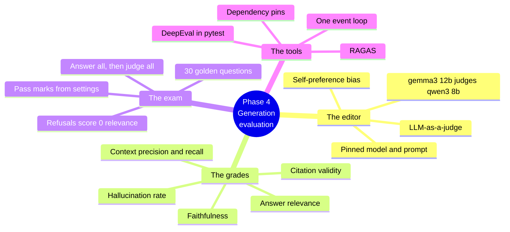

---

# Part A — The ideas

## 0. Where Phase 4 fits

| Part | Library analogy | Phase |
|---|---|---|
| Retriever | The librarian who finds the cards | 2 |
| Generator | The writer who answers with footnotes | 3 |
| Retrieval exam | Did the librarian bring the right books? | 2 |
| **Generation exam** | **The editor: is the writing true to the cards, on topic, and correctly footnoted?** | **4** |

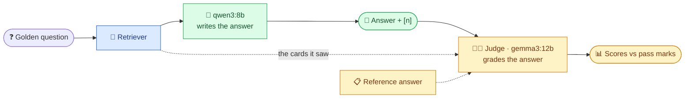

Blue = Phase 2, green = Phase 3, amber = Phase 4.

Retrieval was graded by **counting** (did the right book come back?). Answers can't be graded by counting: two different sentences can both be correct. So we need a reader — another LLM.

---

## 1. LLM-as-a-judge — "an editor who is also a language model"

A **judge** is an LLM we ask to *grade* text instead of writing it. It reads the question, the answer and the cards, and returns a verdict.

It is fast and cheap compared with human reviewers, and good enough to catch most problems. But it is still a model, so three rules keep it honest:

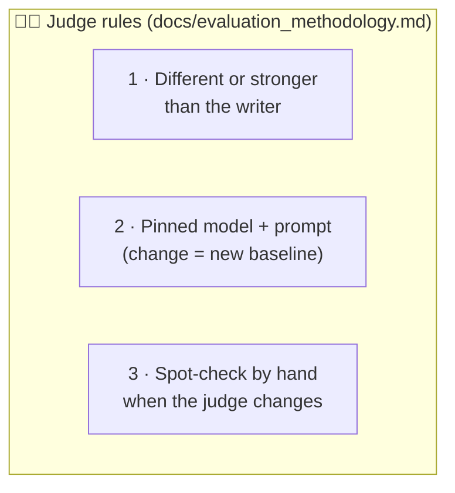

### Self-preference bias — "don't mark your own homework"
A model tends to like text that sounds like its own. If `qwen3:8b` graded `qwen3:8b`, it would be generous. So the judge is **`gemma3:12b`**: a different family (Google's Gemma vs Alibaba's Qwen) and larger (12B vs 8B). Settings even **refuse** a judge equal to the writer:

```text
RAG_JUDGE_MODEL=qwen3:8b  →  ValidationError: the judge model (qwen3:8b) must differ from the model being evaluated
```

### Why local, not OpenAI?
Same reasons as Phase 3: free, private, no key. The price is **speed**: one judge call takes ~20 seconds on a laptop, and a question needs several calls. The design keeps a switch (`RAG_JUDGE_PROVIDER=openai`) for later.

### Did we check the judge is any good?
Before trusting it, we fed it answers where we *knew* the right grade:

| Answer given to the judge | Metric | Expected | gemma3:12b |
|---|---|---|---|
| Correct, cited | faithfulness | 1 | **1.0** |
| Correct, cited | answer relevance | ~1 | **1.0** |
| "MRR was invented by Google in 2015…" (made up) | faithfulness | 0 | **0.0** |
| "Paris is the capital of France." (off topic) | answer relevance | ~0 | **0.002** |

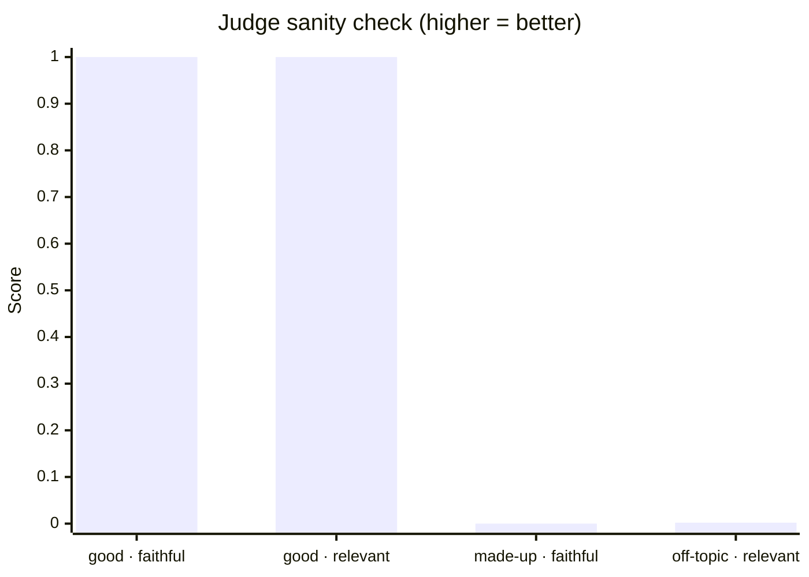

A judge that gave everything 1.0 would be useless. This one separates good from bad.

---

## 2. Faithfulness — "is every sentence backed by a card?"

**Faithfulness** = share of the answer's claims that the retrieved cards support. It is the main defence against **hallucination**.

RAGAS computes it in two judge steps:

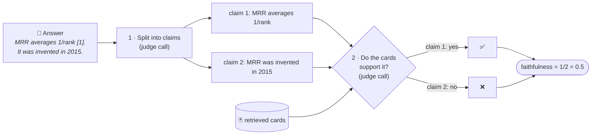

Pass mark: **0.85** (`RAG_MIN_FAITHFULNESS`).

### Hallucination rate
If faithfulness is below 1, at least one claim is unsupported. **Hallucination rate** = share of answers with faithfulness < 1. Faithfulness says *how much* is unsupported on average; hallucination rate says *how often* an answer contains anything unsupported.

---

## 3. Answer relevance — "did it answer *this* question?"

An answer can be 100% faithful and still miss the point ("MRR is a metric [1]."). **Answer relevance** checks that it addresses the question.

RAGAS uses a clever trick: it asks the judge to *invent the question* the answer seems to reply to, then compares that with the real question using **embeddings** (the Phase 1 "meaning codes"):

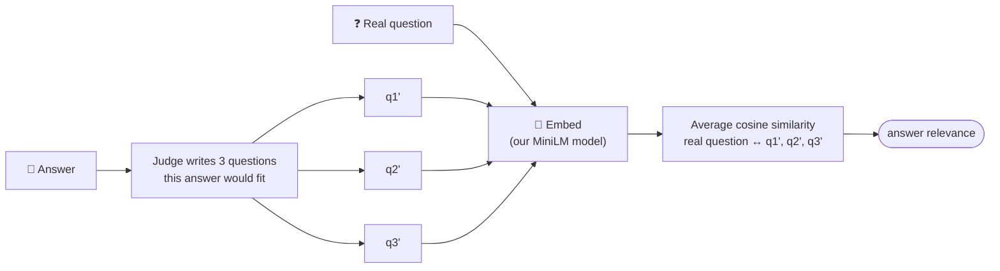

If the answer is on topic, the invented questions look like the real one → high score. Evasive or vague answers ("it depends") are scored 0. Pass mark: **0.80**.

---

## 4. Context precision and recall — "grading the librarian through the editor's eyes"

These two score **retrieval**, but with the judge instead of document ids. They run only with `--full`, because each adds a judge call per question.

| Metric | Question | Analogy |
|---|---|---|
| **Context precision** | Are the useful cards near the top? | Was the good stuff at the top of the pile? |
| **Context recall** | Do the cards contain everything the reference answer needs? | Did the pile have all the facts? |

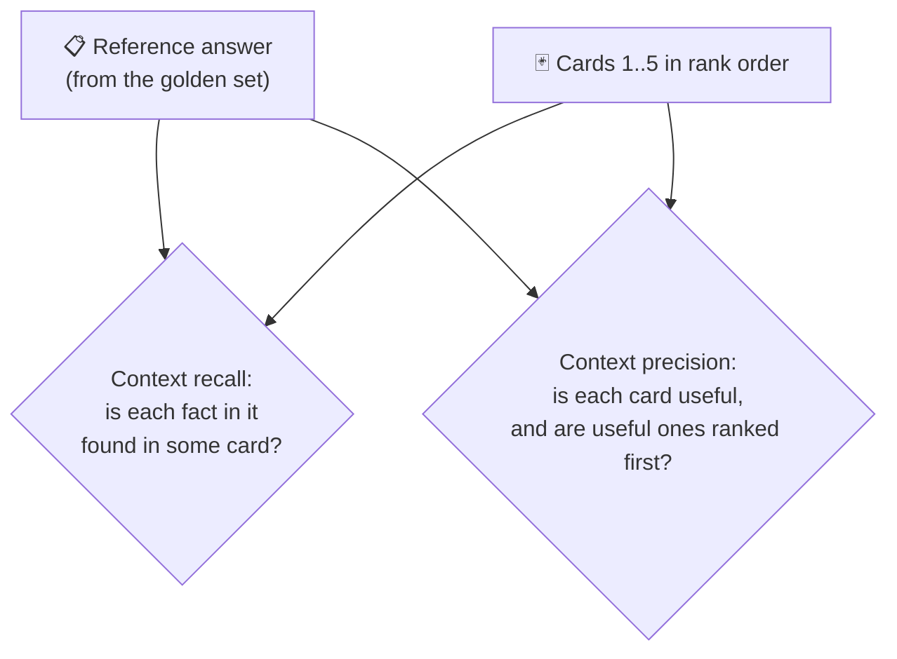

---

## 5. Citation validity — "does the footnote point to the right page?"

Phase 3 could only tell whether `[7]` pointed to a card that **exists**. Phase 4 asks whether the card **supports** the sentence. RAGAS has no metric for our `[n]` style, so we wrote a small one.

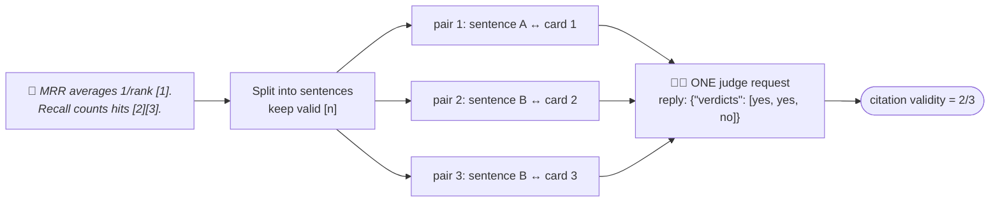

All pairs of one answer go in **one** request (fast), and the judge must reply in JSON. Local models sometimes wrap JSON in chatter or code fences, so the parser tolerates that and the checker **retries once** before giving up.

The three levels of citation checking now:

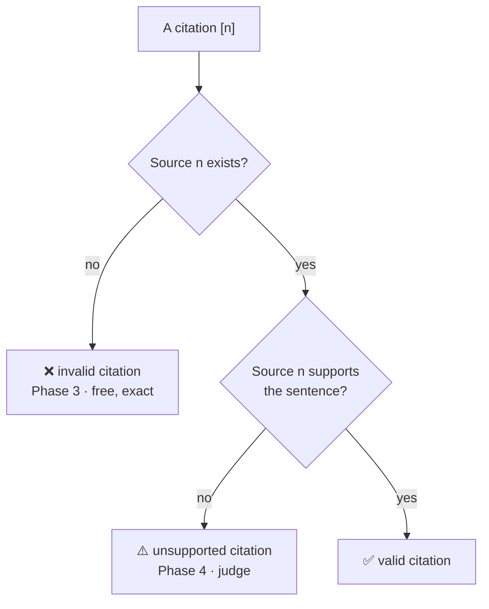

---

## 6. Refusals — "an honest 'I don't know' still fails this exam"

Every golden question **can** be answered from the corpus. So if the model refuses, that's a miss. But refusals make no claims, so faithfulness would look perfect. To stop refusals gaming the scores:

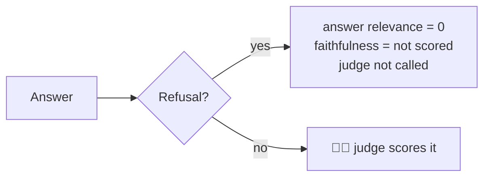

---

## 7. Two passes — "cook everything, then taste everything"

Your Mac has 18 GB of memory. `qwen3:8b` (5 GB) and `gemma3:12b` (8 GB) together would squeeze everything else. So the evaluator never alternates between them:

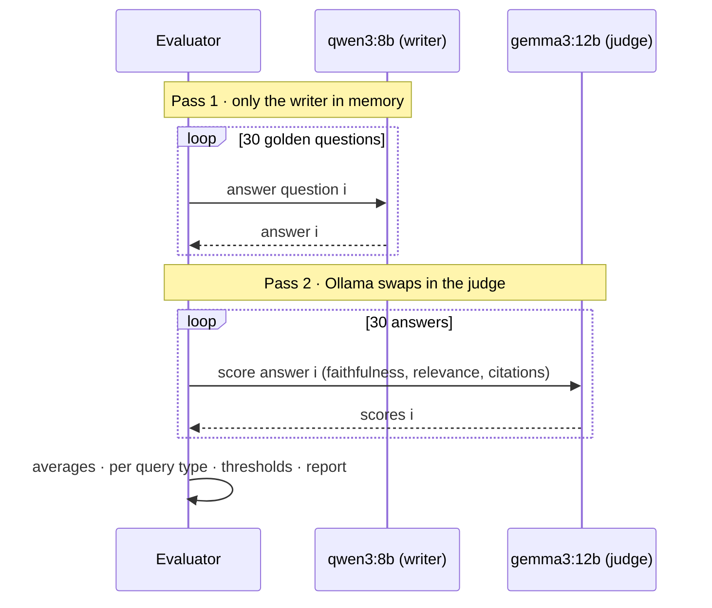

If it alternated (answer 1, judge 1, answer 2, judge 2…), Ollama would reload a 5–8 GB model 60 times.

---

## 8. Where the time goes

A judge call takes ~20 s on a laptop, and running calls in parallel didn't help (Ollama serves one at a time; 4 parallel metrics took 103 s vs ~26 s each). Per question:

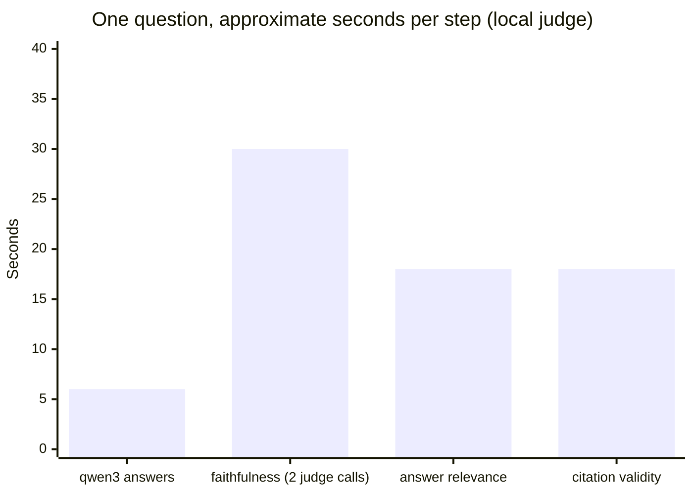

About **70 seconds per question**, almost all of it the judge.

So the default run scores the two thresholded metrics plus citations (~30 min for 30 questions), and:
- `--limit 5` scores the first 5 questions for a quick check;
- `--full` adds context precision and recall (~2 more calls per question).

---

## 9. DeepEval — "the same exam, written as pytest tests"

RAGAS produces a **report**. DeepEval turns the same idea into **tests** that pass or fail:

```python
assert_test(
    test_case,
    [
        FaithfulnessMetric(threshold=0.85, model=judge),
        AnswerRelevancyMetric(threshold=0.80, model=judge),
    ],
)
```

One golden question per query type (short, paraphrase, multi-hop) runs through the real pipeline. They're marked `evaluation` and **skipped** in normal runs because they take minutes:

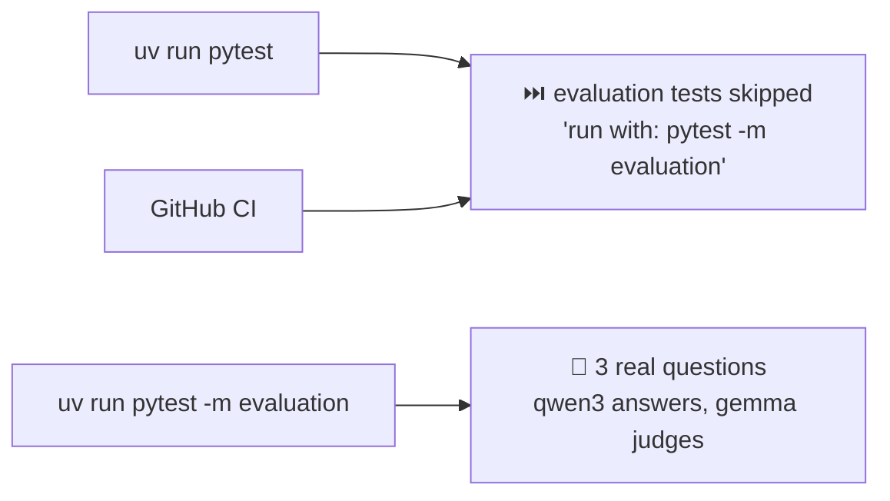

---

## 10. Two gotchas we hit

### Dependency tug-of-war — "two tools that need different screws"
RAGAS needs a helper library (`instructor`) that only works with an older `jiter`; the newest `openai` needs a newer `jiter`. Both can't be installed. We lowered our `openai` floor to `>=2.0` (our code only uses basic chat calls), and the resolver picked `openai` 3.3. Then RAGAS crashed on import: the newest `langchain-community` deleted a module RAGAS still imports, so we cap it at `<0.4.2`. Both pins have a comment in `pyproject.toml` saying why, so nobody "upgrades" them blindly.

### The event loop — "one phone line, kept open"
RAGAS talks to the judge **asynchronously**. Python runs async code on an **event loop**. Our first version started a *new* loop for every question (`asyncio.run`), but RAGAS' HTTP client keeps its connection tied to the loop it first used: on question 2 it would fail with "Event loop is closed". The judge now keeps **one loop for its whole life**, and a unit test checks that every call runs on the same loop.

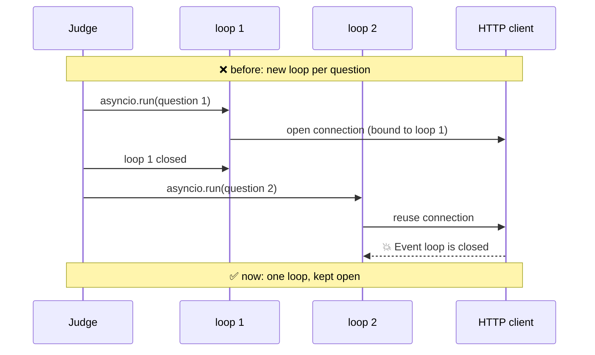

---

## 11. Results on the 30 golden questions

_Filled in from the baseline run (see `docs/evaluation_methodology.md`)._

---

# Part B — The code, file by file

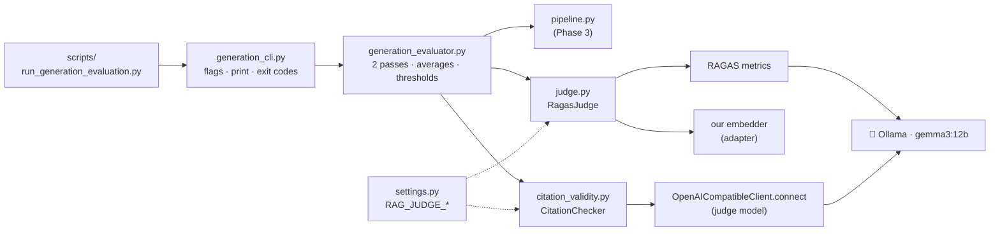

## B1. Settings — the judge's knobs

[src/rag_eval_platform/config/settings.py](../../src/rag_eval_platform/config/settings.py)

```python
JudgeProvider = Literal["ollama", "openai"]
...
judge_provider: JudgeProvider = "ollama"
judge_model: str = "gemma3:12b"
judge_temperature: float = Field(default=0.0, ge=0.0, le=2.0)
judge_max_tokens: int = Field(default=4096, gt=0)
judge_timeout_seconds: float = Field(default=300.0, gt=0)


@model_validator(mode="after")
def _check_judge_differs(self) -> Self:
    if (self.judge_provider, self.judge_model) == (self.llm_provider, self.llm_model):
        raise ValueError("the judge model ... must differ from the model being evaluated ...")
    return self
```

- Temperature **0**: the same answer should get the same grade every time.
- `max_tokens` is higher than the writer's (4096 vs 1024) because the judge writes long lists of claims.
- The validator compares **(provider, model)** pairs: `qwen3:8b` on Ollama as writer and a model named `qwen3:8b` on OpenAI as judge would be different models, so that's allowed.

## B2. `generator.py` — one small refactor

The judge needs a client for **another** model on the same Ollama. Instead of copying the connection code, `from_settings` was split:

```python
def client_options(settings, provider, model, timeout) -> tuple[dict[str, Any], str]:
    # {"base_url": ..., "api_key": "ollama", "timeout": ...} plus a fix hint

class OpenAICompatibleClient:
    @classmethod
    def from_settings(cls, settings):          # the writer
        return cls.connect(settings, provider=settings.llm_provider, model=settings.llm_model, ...)

    @classmethod
    def connect(cls, settings, *, provider, model, temperature, max_tokens, timeout, ...):
        options, hint = client_options(settings, provider, model, timeout)
        return cls(openai.OpenAI(**options), model=model, ...)
```

- `client_options` is shared by the **sync** client (citation checker) and the **async** client RAGAS needs.
- The `*` in `connect(cls, settings, *, provider, ...)` means everything after it must be passed **by name** (`provider="ollama"`), so arguments can't be mixed up.

## B3. `judge.py` — the RAGAS editor

[src/rag_eval_platform/evaluation/judge.py](../../src/rag_eval_platform/evaluation/judge.py)

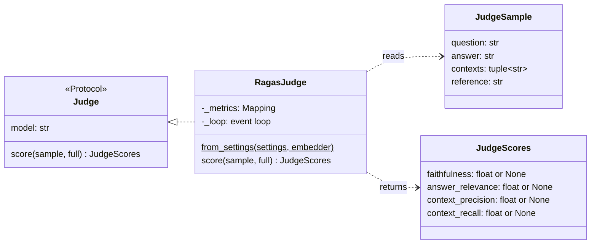

**Building the metrics** (`from_settings`): every RAGAS module is imported through `import_optional`, so the code runs without RAGAS installed (CI) and only fails, with an install hint, when you actually build a judge.

```python
llm = ragas_llms.llm_factory(
    settings.judge_model,
    provider="openai",                       # Ollama speaks the OpenAI API
    client=openai.AsyncOpenAI(**options),
    temperature=settings.judge_temperature,
    max_tokens=settings.judge_max_tokens,
)
metrics = {
    "faithfulness": collections.Faithfulness(llm=llm),
    "answer_relevance": collections.AnswerRelevancy(llm=llm, embeddings=embeddings),
    ...
}
```

**Scoring one answer**:

```python
def score(self, sample, *, full=False) -> JudgeScores:
    names = CORE_METRICS + (CONTEXT_METRICS if full else ())
    return JudgeScores(**self._loop.run_until_complete(self._score_all(sample, names)))
```

- `CORE_METRICS + (CONTEXT_METRICS if full else ())` — tuples add together; the `else ()` adds nothing.
- `JudgeScores(**{...})` unpacks a dictionary into named arguments (seen in Phase 3).
- `run_until_complete` runs async code on **our own** loop (the gotcha from Part A §10).
- A score of `NaN` ("not a number", RAGAS's way of saying "couldn't score") becomes `None`, so averages skip it instead of turning into `NaN` too.
- Any exception becomes a `JudgeError` with the hint "Is Ollama running…". The same "translate at the boundary" pattern as `GenerationError`.

**The embedder adapter** lets RAGAS use *our* MiniLM model:

```python
def make_ragas_embeddings(embedder: Embedder, base: type) -> Any:
    class _ProjectEmbeddings(base):
        def embed_text(self, text, **kwargs):
            return list(embedder.embed_query(text))

        async def aembed_text(self, text, **kwargs):
            return self.embed_text(text)

    return _ProjectEmbeddings()
```

A class defined **inside a function** — it can use `embedder` from the surrounding function (a *closure*). The RAGAS base class is passed in, so tests can hand it a dummy base and never import RAGAS.

## B4. `citation_validity.py` — the footnote checker

[src/rag_eval_platform/evaluation/citation_validity.py](../../src/rag_eval_platform/evaluation/citation_validity.py)

```python
_SENTENCE_END = re.compile(r"(?<=[.!?])\s+")
_LEADING_CITATIONS = re.compile(r"^(?:\s*\[\s*\d+(?:\s*,\s*\d+)*\s*\])+")
```

- `(?<=[.!?])` is a **look-behind**: "split at spaces that come *after* `.`, `!` or `?`", without eating the punctuation.
- `_LEADING_CITATIONS` catches `"claim. [1] Next claim"`: after splitting, `[1]` sits at the start of the next sentence, so the code moves it back to the sentence it belongs to.

```python
def parse_verdicts(text: str, expected: int) -> tuple[bool, ...]:
    match = _JSON_OBJECT.search(text)  # finds {...} even inside chatter or ```json
    verdicts = json.loads(match.group(0))["verdicts"]
    if not isinstance(verdicts, list) or len(verdicts) != expected:
        raise JudgeError(...)
```

- The count **must** match: if we sent 3 pairs and got 2 verdicts, we can't know which one is missing, so it's an error (and a retry).
- `zip(cited, supported, strict=True)` — pairs up two lists and **raises** if their lengths differ, so a verdict can never be glued to the wrong citation silently.

## B5. `generation_evaluator.py` — the exam

[src/rag_eval_platform/evaluation/generation_evaluator.py](../../src/rag_eval_platform/evaluation/generation_evaluator.py)

```python
answers = []
for i, example in enumerate(examples, start=1):
    answers.append(pipeline.ask(example.question))  # pass 1: writer only
    progress(f"Answered {i}/{len(examples)}: {example.id}")

results = []
for i, (example, answer) in enumerate(zip(examples, answers, strict=True), start=1):
    results.append(_judge_example(example, answer, judge, citation_checker, full))  # pass 2
```

Averages skip missing values:

```python
def _mean(values: Sequence[float | None]) -> float | None:
    present = [v for v in values if v is not None]
    return sum(present) / len(present) if present else None
```

```python
hallucination_rate = (_mean([float(f < 1.0) for f in faithfulness if f is not None]),)
```

`float(True)` is `1.0` and `float(False)` is `0.0`, so the average of those is "the share of answers where `f < 1`".

Threshold check — an unscored metric **fails**, it never silently passes:

```python
if value is None:
    failures.append(f"{name} was not scored")
elif value < minimum:
    failures.append(f"{name} {value:.3f} < {minimum:.3f}")
```

## B6. `generation_cli.py` — the exam hall

Same shape as Phase 2's retrieval CLI: flags → run → print table → write JSON → exit code **0 / 1 / 2**. New flags:

| Flag | Effect |
|---|---|
| `--limit N` | only the first N golden questions (`[: args.limit]`; `None` means all) |
| `--full` | add context precision and recall |

`_positive_int` is a custom **argparse type**: `--limit 0` is rejected before anything runs.

## B7. The tests

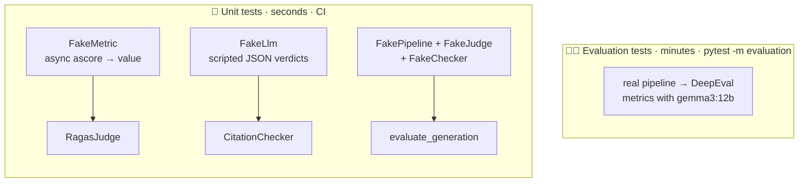

- **Fake RAGAS**: `test_judge.py` builds fake `ragas.llms` / `ragas.metrics.collections` modules with `SimpleNamespace` and swaps `import_optional`, so `from_settings` is tested without RAGAS installed.
- **Ordering test**: a pipeline and judge that record events prove every answer is generated before any judging.
- **Same-loop test**: a metric records `asyncio.get_running_loop()`; two `score()` calls must see the same loop.
- **CI-like check**: the unit tests were also run in a fresh environment built exactly like CI (no RAGAS, DeepEval or openai): all pass.
- `tests/conftest.py` skips `evaluation` tests unless `-m evaluation` is given, and `-p no:deepeval` stops DeepEval's pytest plugin (telemetry and a noisy teardown line).

## B8. Python ideas used in Phase 4

| Idea | Where | One-line meaning |
|---|---|---|
| `asyncio` event loop | `RagasJudge` | Runs async code; RAGAS is async |
| `loop.run_until_complete` | `RagasJudge.score` | Run one coroutine on a loop you own |
| Closure / class in a function | `make_ragas_embeddings` | Inner code remembers outer variables |
| Keyword-only args (`*`) | `OpenAICompatibleClient.connect` | Arguments after `*` must be named |
| Look-behind regex `(?<=…)` | sentence splitting | Match a position after something, without consuming it |
| `zip(..., strict=True)` | citation verdicts, evaluator | Pair lists and fail on length mismatch |
| `math.isnan` | judge scores | Detect "not a number" |
| `float(bool)` | hallucination rate | `True → 1.0`, `False → 0.0`, so an average is a share |
| `SimpleNamespace` | test fakes | A quick object with attributes, for fakes |
| Custom argparse type | `--limit` | Validate a flag before the program runs |
| `pytest_collection_modifyitems` | `tests/conftest.py` | Change which collected tests run |

---

## 12. Cheat sheet

```bash
# once
ollama pull gemma3:12b                                  # the judge (8 GB)
uv sync --all-extras --all-groups                       # + RAGAS, DeepEval

# quick check (first 3 questions)
uv run python scripts/run_generation_evaluation.py --limit 3

# full exam (~30 min) and with context metrics (~50 min)
uv run python scripts/run_generation_evaluation.py
uv run python scripts/run_generation_evaluation.py --full

# DeepEval as pytest (3 questions)
uv run pytest -m evaluation -v

# a different judge for one run (then re-baseline!)
RAG_JUDGE_MODEL=qwen3:14b uv run python scripts/run_generation_evaluation.py --limit 3
```

---

## 13. Glossary

| Term | One-line meaning |
|---|---|
| LLM-as-a-judge | Using an LLM to grade another LLM's output |
| Self-preference bias | A model rating text like its own too kindly |
| Faithfulness | Share of the answer's claims supported by the retrieved cards |
| Hallucination rate | Share of answers with at least one unsupported claim |
| Answer relevance | How directly the answer addresses the question |
| Context precision | Whether useful cards are ranked near the top |
| Context recall | Whether the cards contain everything the reference answer needs |
| Citation validity | Share of `[n]` citations whose card really supports the sentence |
| RAGAS | A library of RAG metrics computed with a judge LLM |
| DeepEval | A library that turns LLM metrics into pytest-style tests |
| Baseline | The first scores every later change is compared against |
| Re-baselining | Measuring again after changing the judge, prompt or thresholds |
| Event loop | Python's scheduler for async code |
| `NaN` | "Not a number": a score that couldn't be computed |

---

## 14. Check yourself

1. Why is the judge `gemma3:12b` and not `qwen3:8b`?
2. An answer has 4 claims; the cards support 3. What is its faithfulness? Does it count towards the hallucination rate?
3. Why can an answer have faithfulness 1.0 but answer relevance near 0?
4. Phase 3 already flags `[7]` when there are 5 sources. What does Phase 4's citation validity add?
5. Why does the evaluator answer all 30 questions before judging any?
6. A refusal makes no claims. Why don't we give it faithfulness 1.0?
7. Why does the judge keep one event loop instead of calling `asyncio.run` each time?
8. Why are the `evaluation` tests skipped in a normal `pytest` run?
9. You change the judge to another model. What must you do with the baseline?
10. The judge replied with 2 verdicts for 3 citations. What happens?

<details>
<summary>Answers</summary>

1. A model grading itself tends to be generous (self-preference bias). gemma3 is a different family and larger; settings refuse a judge equal to the writer.
2. 3/4 = 0.75. Yes: faithfulness below 1 means at least one unsupported claim.
3. Everything it says can be true and backed by the cards while not answering the question asked (e.g. "MRR is a metric [1]." for "How is MRR computed?").
4. Whether the cited card, which exists, actually **supports** the sentence (a valid-but-wrong footnote).
5. So only one model is in memory at a time; alternating would reload 5–8 GB models dozens of times.
6. Every golden question is answerable, so a refusal is a miss. It gets answer relevance 0, and no faithfulness so it can't pull the faithfulness average up.
7. RAGAS' async HTTP client stays bound to the first loop; a new loop per call breaks it ("Event loop is closed").
8. They call a real judge and take minutes; they run only with `pytest -m evaluation`.
9. Re-run the full evaluation and record the new numbers as the baseline; old and new scores aren't comparable.
10. The count doesn't match, so `parse_verdicts` raises; the checker retries once, and if that fails too the run stops with a `JudgeError` (exit code 2).

</details>
