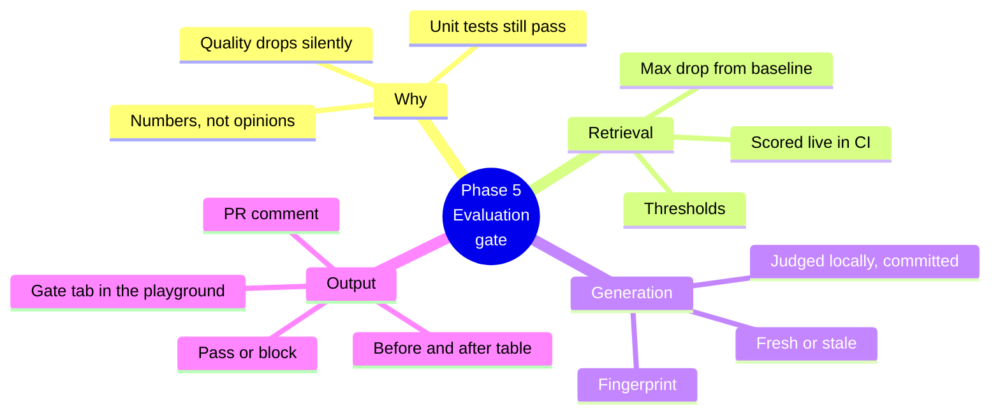
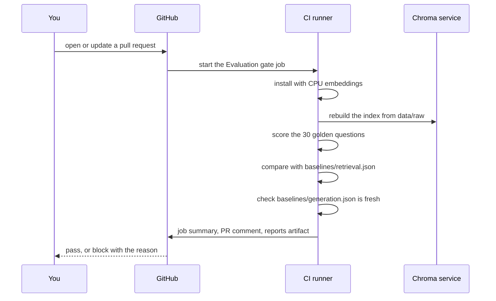
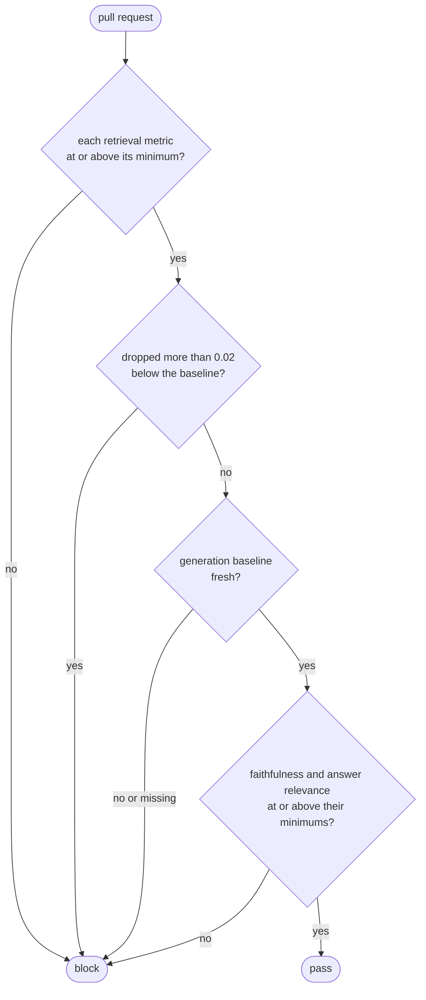
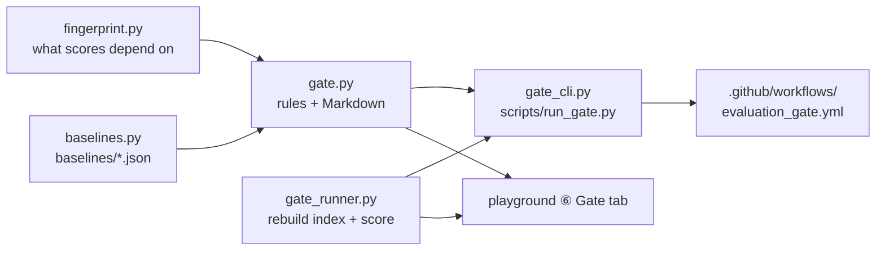

# Phase 5 — The evaluation gate, explained simply

Phases 2 and 4 built the **exams**: 30 golden questions, scored for retrieval (did we find the right documents?) and for generation (is the answer grounded and on topic?). But an exam only helps if someone actually sits it. Phase 5 adds the **exam hall at the door**: every pull request must pass it before it can merge.

Part A explains the ideas. Part B walks through the code and shows you how to try it.



---

## Part A — The ideas

### 1. Why a gate at all?

Imagine you change the chunk size from 800 to 400 characters to "make search more precise". Every unit test still passes: the code works. But multi-hop questions, which need two documents, may now miss one. Nobody notices until a user gets a worse answer.

A gate turns *"I think it's better"* into *"the numbers say it's better, or at least not worse"*. It runs the golden questions on every pull request and **blocks the merge** if quality drops.

### 2. What runs where

GitHub's free runners have no GPU and about 7 GB of memory. Retrieval is cheap: a small embedding model on the CPU scores all 30 questions in about a minute. Generation is not: two local models (a writer and a judge) take about an hour even on a GPU.

So the gate splits the work:

| | Where it runs | How often |
|---|---|---|
| **Retrieval** (Recall@k, MRR, NDCG@k) | Live in CI, on every pull request | Every time |
| **Generation** (faithfulness, answer relevance) | On your machine, with Ollama; the result is **committed** as a baseline | Only when something it depends on changes |



### 3. The rules



Two kinds of protection work together:

- **Thresholds** are the floor: Recall@k ≥ 0.80, MRR ≥ 0.70, NDCG@k ≥ 0.70, faithfulness ≥ 0.85, answer relevance ≥ 0.80.
- **Max drop** catches a slide that is still above the floor. Recall going from 0.93 to 0.85 is still above 0.80, but it is a real loss. The gate blocks any retrieval metric that drops more than `RAG_GATE_MAX_DROP` (0.02) below the committed baseline. With 30 questions, one question going from hit to miss moves Recall by 1/30 ≈ 0.033, so a single lost question already blocks: deliberate, because the golden set is small and every question matters.

### 4. The fingerprint: is the generation baseline still true?

A committed generation score is only valid for the setup that produced it. The **fingerprint** records that setup:

| Field | Why it matters |
|---|---|
| generator model, temperature, reasoning effort, prompt version | a different writer or prompt writes different answers |
| judge model, citation prompt version | a different judge grades differently |
| embedding model, chunk strategy, size, overlap, top-k, re-ranking | different sources reach the prompt |
| hash of the golden set | different questions |
| hash of `data/raw/` | different documents (hidden files like `.DS_Store` are ignored) |

When any field differs, the baseline is **stale** and the gate lists exactly what changed, for example `chunk_size: 800 → 400`. The fix is to re-judge and commit.

> **Analogy.** The fingerprint is the label on a lab sample: *who took it, when, with which equipment*. A result with the wrong label can't be trusted, however good it looks.

### 5. The report

Every run writes a before/after table. CI puts it in the job summary and in **one** pull-request comment, which it updates on each push rather than adding a new one. It finds its own comment by a hidden marker, `<!-- rag-eval-gate -->`.

```text
## ✅ Evaluation gate passed

| Check    | Baseline | Now   | Change | Minimum | Result |
| recall@k | 0.933    | 0.933 | +0.000 | 0.80    | ✅ ... |
...
### Retrieval by query type
| multi_hop | 0.667 → 0.667 | ...
```

---

## Part B — The code



| File | What it does |
|---|---|
| `evaluation/fingerprint.py` | `current_fingerprint(settings)` and `fingerprint_changes(saved, current)`. When re-ranking is off, its candidate count and model are left out, because they cannot change the scores. |
| `evaluation/baselines.py` | `load_baseline`, `save_baseline` and `check_adoptable` for the tracked `baselines/retrieval.json` and `baselines/generation.json`. |
| `evaluation/gate.py` | `run_gate(...)` returns a `GateResult` (a list of `Check`s plus the stale changes). `gate_markdown` writes the table. |
| `evaluation/gate_runner.py` | `rebuild_and_evaluate(...)`: load `data/raw/`, chunk, embed, store, then score the golden set. Used by CI and by the playground. |
| `evaluation/gate_cli.py` | `scripts/run_gate.py`: exit 0 pass, 1 blocked, 2 could not run. |
| `evaluation/baseline_cli.py` | `scripts/save_baseline.py`: adopts an existing full report after checking its versions. |

### Commands

```bash
uv run python scripts/run_gate.py                                # the gate, locally (Chroma running)
uv run python scripts/run_evaluation.py --save-baseline          # new retrieval baseline
uv run python scripts/run_generation_evaluation.py --save-baseline   # re-judge (~1 hour) + save
uv run python scripts/save_baseline.py generation reports/generation_report.json   # adopt a full run
```

`--save-baseline` first **rebuilds the index** from `data/raw/` with the current settings, so the saved scores always come from an index that matches the fingerprint stamped on them. Every generation report also records its fingerprint; `save_baseline.py` adopts a report only when that fingerprint matches the current one (a report from before fingerprints existed needs `--legacy`).

Updating a baseline changes a tracked file, so it shows up in the pull request's diff and gets reviewed, just like changing a threshold.

### Making the check required

The workflow reports pass or fail, but GitHub only **blocks** the merge when the check is required: repository **Settings → Branches → Branch protection rule for `main` → Require status checks to pass → "Evaluate against golden dataset"**.

---

## Try it: the ⑥ Gate tab

Start the playground (`uv run streamlit run src/rag_eval_platform/playground/app.py`) and open **⑥ Gate**.

1. Click **Run the gate** with the default sidebar. It rebuilds the sample corpus into a separate `gate_preview` collection (your uploads and the evaluation index are untouched) and scores the 30 questions. Everything turns green.
2. Open the sidebar and drag **Chunk size** down to 200, then run again. Retrieval stays within 0.02 of the baseline, but the flow turns red at **Generation baseline**: the fingerprint changed (`chunk_size: 800 → 200`), so the committed answer scores no longer apply.
3. Try **fixed** chunking, or **top-k 1**, and look at **Questions that flipped**: which golden questions went from hit to miss, and which documents they needed.

What to notice: the gate never guesses. Every block names the metric or the setting that caused it, and the exact command that fixes it.
