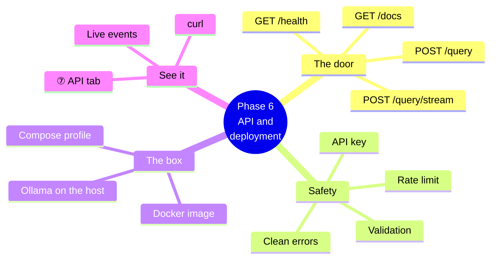
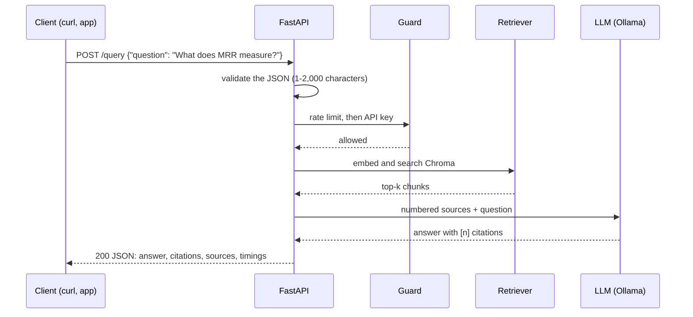
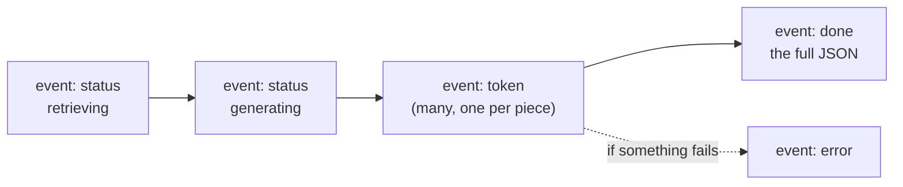
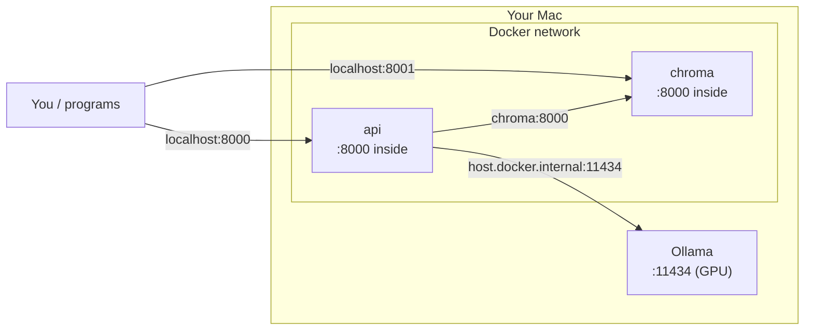

# Phase 6 — The API and deployment, explained simply

Until now you asked questions through a person-shaped door: the playground, or the `ask.py` command. Phase 6 adds a **program-shaped door**: an HTTP API. Any program (a website, a Slack bot, a script, another service) can now send a question and get back a cited answer as JSON. Phase 6 also packs the API into a **container**, so it runs the same way on any machine.

Part A explains the ideas. Part B walks through the code and shows you how to try it.



---

## Part A — The ideas

### 1. What an API is, and why

The playground draws pictures for people. An **API** (application programming interface) speaks a fixed language that other programs understand: they send a request in JSON, and they get a response in JSON. The pipeline behind it is exactly the same one: retrieve the right chunks, then generate a cited answer.

> **Analogy.** The playground is the restaurant's dining room; the API is the takeaway window. Same kitchen, same recipes, a simpler way to hand food out.

### 2. One request, step by step



### 3. The endpoints

| Endpoint | What it does |
|---|---|
| `GET /health` | Is Chroma reachable (how many chunks)? Does Ollama have the model? `200` when both are fine, `503` otherwise, naming the failing check. |
| `POST /query` | A cited answer as JSON. |
| `POST /query/stream` | The same answer, streamed as it is written (see below). |
| `GET /docs` | Interactive documentation, generated from the code: try every endpoint in the browser. |

```bash
curl -s -X POST http://127.0.0.1:8000/query \
  -H 'Content-Type: application/json' \
  -d '{"question": "What does MRR measure?", "answer_style": "concise"}'
```

```json
{
  "answer": "MRR measures how high the first relevant document appears in the ranked results [1].",
  "refusal": false,
  "citations": [{"number": 1, "doc_id": "retrieval_metrics.md", "page": null, "chunk_id": "retrieval_metrics.md#0"}],
  "sources": [{"number": 1, "doc_id": "retrieval_metrics.md", "score": 0.83, "...": "..."}],
  "model": "qwen3:8b",
  "timings": {"retrieve_ms": 645.2, "generate_ms": 10359.5, "total_ms": 11004.9}
}
```

### 4. Streaming: watching the answer being written

A full answer can take several seconds. `/query/stream` sends **server-sent events** (a standard, simple format: plain text lines over one HTTP response) as the answer is written:



```bash
curl -s -N -X POST http://127.0.0.1:8000/query/stream \
  -H 'Content-Type: application/json' -d '{"question": "What is NDCG?"}'
```

### 5. Safety basics

| Protection | What it does |
|---|---|
| **Validation** | The question must be 1–2,000 characters (spaces-only is rejected), `answer_style` must be `concise` or `detailed`, and unknown fields are refused: `422`. |
| **API key** | Set `RAG_API_KEY` and every request must send the `X-API-Key` header, or it gets `401`. It is off by default for local use and compared in constant time. |
| **Rate limit** | At most `RAG_API_RATE_LIMIT` requests per minute per client (default 30), otherwise `429` with a `Retry-After` header. |
| **Clean errors** | Every error is `{"error": ..., "hint": ...}`: `502` if the LLM fails, `503` if Chroma is down. Never a stack trace. |

`/health` and `/docs` never need the key, so monitoring keeps working.

### 6. The box: running it in Docker



- The image is built in two stages with uv: dependencies first (CPU-only torch), then the code, then the embedding model is downloaded **into** the image, so the container needs no internet at run time. It runs as a non-root user and has a health check.
- Ollama stays on your Mac, because the Mac's GPU is not available inside Docker; the container reaches it through `host.docker.internal`.
- The `api` service is in the `api` **profile**, so plain `docker compose up -d` still starts only Chroma.
- CI builds the image on every push and checks that `/health` answers. It is `503` there, because CI has no Ollama; that is expected.

---

## Part B — The code

| File | What it does |
|---|---|
| `api/schemas.py` | The request and response models (pydantic), and `to_response`, which maps a pipeline `Answer` to JSON. |
| `api/security.py` | `check_api_key` (constant-time) and `RateLimiter` (a sliding window per client). |
| `api/health.py` | `chroma_check` and `llm_check`: each returns ok/detail and never raises. |
| `api/sse.py` | `sse_event`: the text/event-stream format. |
| `api/services.py` | What the app needs at run time (pipelines, checks, key, limiter), and `guard`. |
| `api/routes.py`, `api/main.py` | The endpoints; `create_app(services)` for tests (fakes), `create_app_from_settings` for real (the models load once). |
| `api/serve.py`, `scripts/serve_api.py` | Run it with Uvicorn. |
| `docker/Dockerfile`, `.dockerignore`, `docker/docker-compose.yml` | The image and the `api` profile. |

### Commands

```bash
uv run python scripts/serve_api.py                              # http://127.0.0.1:8000, docs at /docs
docker compose -f docker/docker-compose.yml --profile api up -d --build   # the same, in Docker
curl -s localhost:8000/health
```

---

## Try it: the ⑦ API tab

Start the API (`uv run python scripts/serve_api.py`), then open **⑦ API** in the playground.

1. The pill says **API up**. Press **Send**: you get the status code, the time and the JSON, and the flow diagram fills in with how long retrieval and generation took.
2. Copy the **curl** command shown and run it in a terminal: the same request, outside the playground. (If you set `RAG_API_KEY`, the key is masked on screen.)
3. Turn on **Stream** and press **Send** again: watch the `status` and `token` events arrive, then `done`.
4. Stop the API: the tab tells you how to start it, and **Send** is disabled.
5. Open `http://127.0.0.1:8000/docs` and try `/query` from the browser.

What to notice: it is the same pipeline, the same citations and the same log line as the playground. Only the door is different.
