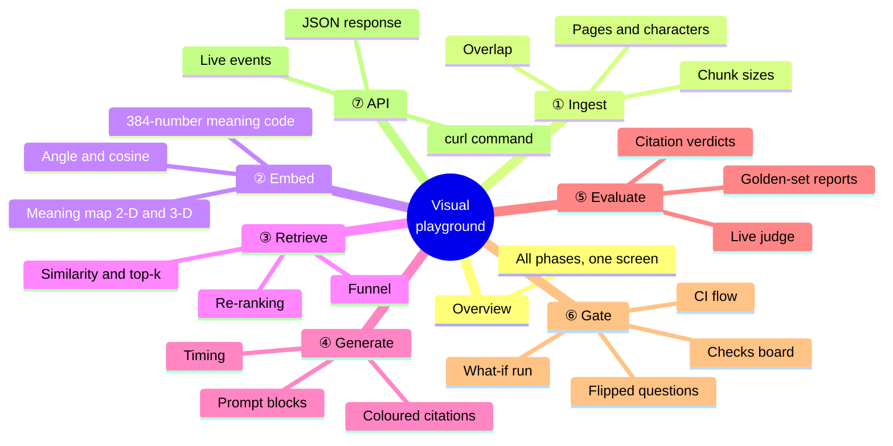
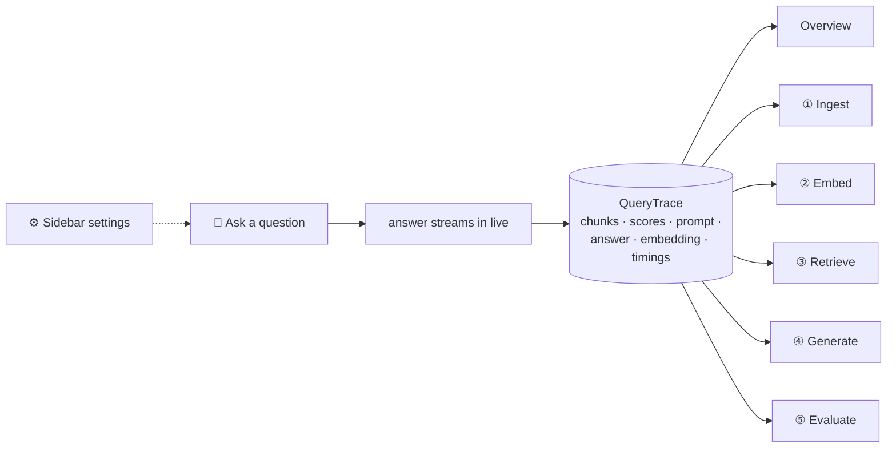
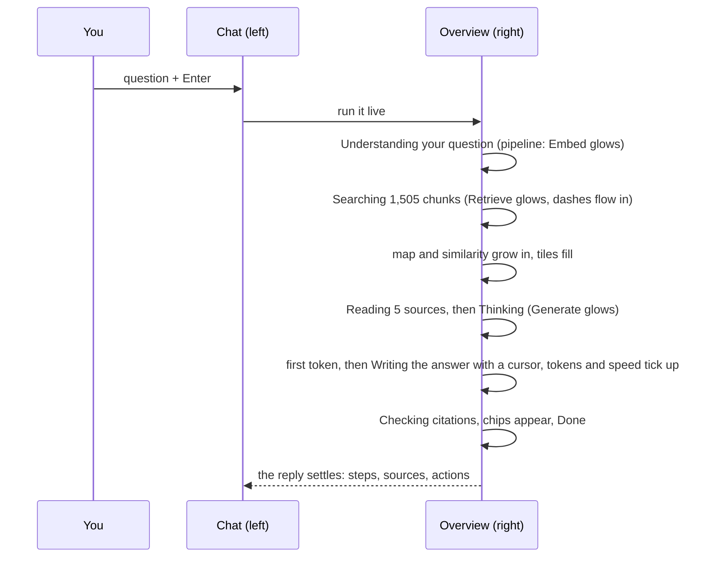
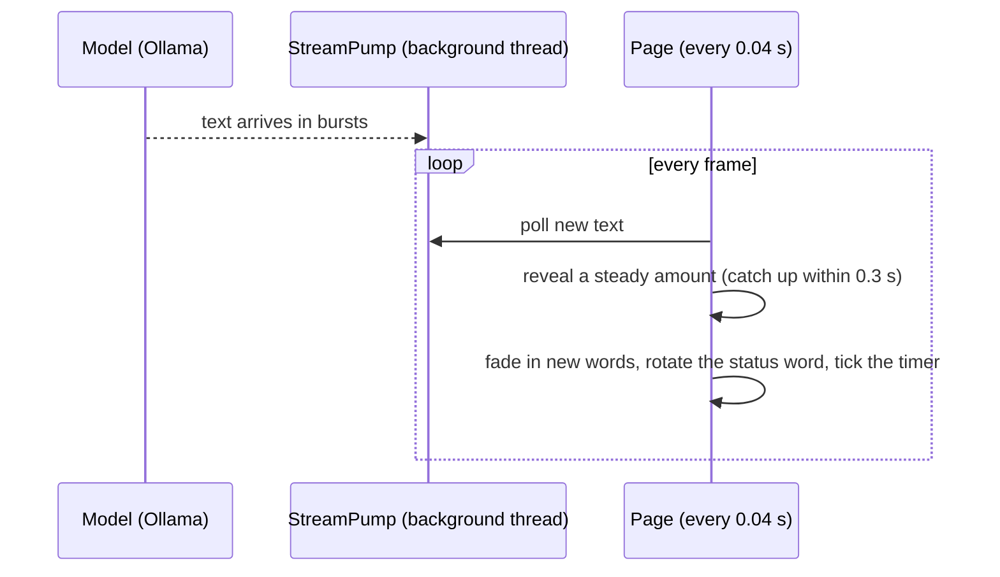
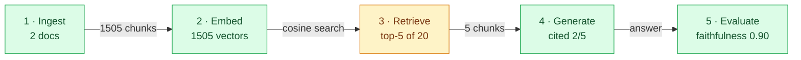
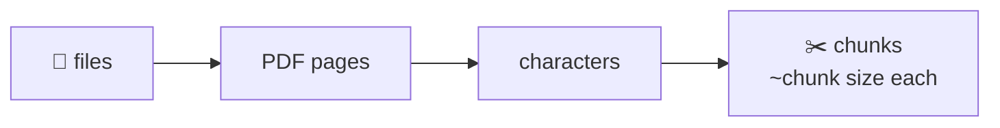
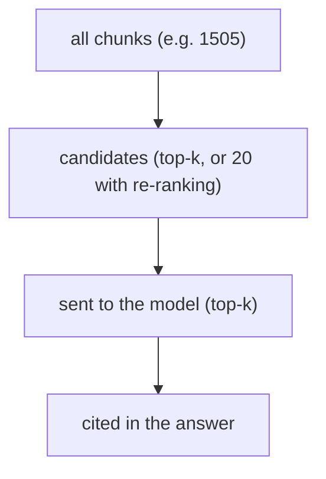
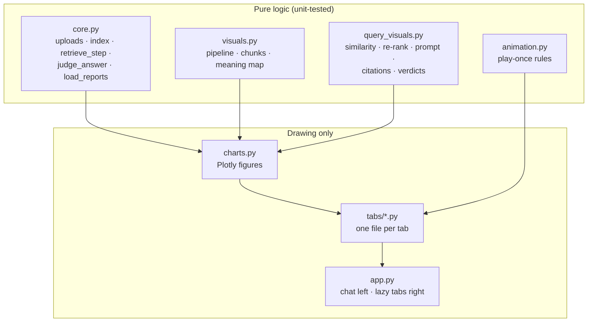

# The visual playground, explained simply

The playground is where every idea from Phases 1–6 becomes something you can **see move**. You upload your own documents, ask one question, and the tabs show what each phase did with it. The ⑥ Gate tab shows how CI decides whether a change may merge.

```bash
uv run streamlit run src/rag_eval_platform/playground/app.py    # http://localhost:8501
```

Needs Chroma (`docker compose -f docker/docker-compose.yml up -d`), Ollama (`brew services start ollama`) and `uv sync --all-extras --all-groups`.



---

## 1. One question drives everything



You ask once. Everything the pipeline did along the way is kept in one record (the *trace*), and every tab draws from it. Switching tabs never re-runs the model.

### Watching it live

The page is split in two: a **chat** on the left, the **dashboard** on the right. Type in the chat box and press Enter (or click a 💡 suggestion). The dashboard jumps to the **Overview** and runs the question there while the reply streams into the chat, side by side:



The chat works like Claude's. Your message sits in a warm bubble on the right, and the reply is written the way a chat assistant writes:

- **A status line like Claude Code's**: a spinning ✻ and a shimmering word that changes every 1.5 s to fit the step (*Searching, Scouring, Sifting…* while searching; *Thinking, Pondering, Mulling, Incubating, Churning…* while the model gets ready; *Writing, Composing, Crafting…* while it writes), with a live timer and token count: `Composing… (20s · ↓ 257 tokens)`.
- **Finished steps as ✓ lines**, like a coding assistant's tool calls: `✓ Searched 11 chunks → best match 0.23 · 0.7 s`, `✓ Read 5 sources`, `✓ Wrote 328 tokens · 18 tok/s`.
- **A steady rhythm**: the model sends text in bursts, so a background thread collects it and the page reveals it evenly, a word at a time, about 25 times a second, catching up within 0.3 s, so it never stalls or jumps.
- **Words come into focus**: each new piece starts faint and blurred (opacity 0.2, 3 px blur) and sharpens over about 0.9 s (1.6 s in slow motion), so the newest lines always carry a soft gradient, the way Claude writes. Headings, lists, tables and citation chips form as they arrive.
- **Light or dark**: pick **⋮ → Settings → Light, Dark or System** (System follows your computer). Every colour in the app has a light and a dark value, so the switch is instant.



When the answer is done you get:

| Part | What it shows |
|---|---|
| **✓ 3 steps · 8.1 s** | click to open: searched the documents, re-ranked (if it changed the order), wrote the answer (tokens, tok/s), checked citations |
| coloured **[1] [2]** chips | each claim's source, in the same colour as the dashboard |
| **Sources** line | the pages that were actually cited, e.g. `[2] book.pdf, page 25` |
| **📚 5 sources · 1 cited** | click to read every chunk that was sent to the model |
| meta line | model · tokens · speed · total time · 📊 if the dashboard shows this answer |
| 📋 🔄 ⚖️ 📊 👍 👎 | copy · regenerate · judge it (score badges appear) · show it in the dashboard · feedback |

The sidebar's **Answer style** picks how the model writes. **Detailed** (the default) asks for a direct answer first, then `##` sections, bullet lists, **bold** key terms and a table when comparing things, still citing every claim. **Concise** is the few-sentence style that the golden-set evaluation uses. The two prompts are versioned separately (`v1` and `v1-detailed`), so the chat's long answers never change the evaluation's baseline scores.

There is **no chat memory**: every question is answered on its own from your documents, so an earlier question can't leak into a later answer. **New chat** clears the conversation.

The **first token** tile is how long the model took before writing anything: loading into memory (a cold start) and reading the prompt. **Speed** is measured *after* the first token, so a slow start does not look like slow writing. Turn on **🐢 Slow motion** in the sidebar to stretch every pause, write the answer at a fixed, slow pace you can follow, change the status word every 3 s, and grow the charts over more frames.

At the top of every tab, a **pipeline diagram** shows where you are:



Amber = the tab you're on, green = phases with data, grey = not done yet (e.g. "not judged").

---

## 2. What each tab teaches

| Tab | Concept | What to try |
|---|---|---|
| **① Ingest** | Documents become **chunks**; **overlap** keeps a sentence cut at a boundary whole in one chunk | Change *chunk size* to 400, rebuild, and watch the histogram shift left and the chunk count rise |
| **② Embed** | Each chunk is **384 numbers**; similar meanings point the same way | Ask two different questions and watch the orange diamond jump across the map; switch to **3-D** and rotate it |
| **③ Retrieve** | **Top-k** by cosine similarity; a **cross-encoder** re-ranks | Turn on *Re-rank* and ask again: crossing lines show where the cross-encoder disagreed with vector search |
| **④ Generate** | The **prompt** is rules + numbered sources + question; **citations** point to sources | Set *Top-k* to 1 and ask a broad question; check whether the model refuses or cites only `[1]` |
| **⑤ Evaluate** | An **LLM judge** grades faithfulness, relevance and citation validity | Judge an answer, then ask something your documents don't cover and compare |
| **⑥ Gate** | The **CI gate**: every change is scored on the golden set before it merges | Run the gate with the defaults (pass), then drag *Chunk size* to 200 and run again (blocked: the generation baseline is stale) |
| **⑦ API** | The same pipeline over **HTTP**, for other programs | Start the API, press Send, then copy the curl command into a terminal; turn on Stream to watch the events |
| **Overview** | The whole chain at once | Keep it open while you change settings and ask again |

### ① Ingest: from files to chunks



The **chunk layout** chart draws each chunk as a bar along its document. The red part is the **overlap** with the previous chunk: the characters both chunks share.

### ② Embed: the meaning map

The map squeezes 384 dimensions down to 2 or 3 with **PCA** (principal component analysis: keep the directions in which the chunks differ most). Distances on the map are approximate, but neighbours in meaning stay roughly neighbours. The "meaning code" strips compare your question's 384 numbers with the top chunk's, and the **angle** between them is what retrieval ranks by (cosine similarity = cos(angle)).

### ③ Retrieve: the cut-off and the funnel



The funnel's widths use a **log scale**, so 2 cited chunks stay visible next to 1,505 in total; the labels show the true counts.

### ④ Generate: follow a citation

Each `[n]` in the answer has the colour of source *n* in the list beside it, so you can trace a claim to its chunk by eye. A red, struck-through `[n]` points to a source that was never given (an **invalid citation**).

### ⑤ Evaluate: grade this answer

**Judge this answer** sends it to `gemma3:12b` (1–2 minutes). The gauges fill with faithfulness, relevance and citation validity; the verdict diagram draws each cited sentence → its chunk, green if the chunk supports it. Below, the golden-set reports show how the whole system scored on the 30 test questions.

### Answer health: instant quality, no judge

The judge takes 1–2 minutes, so every answer also gets **instant** checks the moment it finishes (the first Overview panel, and the chat's meta line):

| Metric | What it measures | How to read it |
|---|---|---|
| **Coverage** | share of claims (sentences, bullets, table rows) that cite a source | low = the model states things without saying where from |
| **Grounding** | for each cited claim, the share of its content words found in the source it cites | a word-overlap stand-in for faithfulness: high = wording comes from the sources; low = possibly the model's own claim |
| **Sources · context · answer** | distinct pages sent, characters (and prompt tokens) in the prompt, words in the answer | more context is not always better: watch coverage when it grows |
| **Time** | search + first token + writing (hover for the split) | a long first token usually means the model was loading |

Bars turn green at 80%, amber at 50%, red below. The header shows session KPIs (questions, average time, average coverage, 👍/👎), and **⑤ Evaluate** opens with **This session**: time per question and coverage and grounding lines, so you can see whether a settings change helped.

### ⑥ Gate: would this change merge?

**Run the gate** rebuilds the sample corpus (`data/raw/`) with your sidebar's chunking, top-k and re-ranking in a separate `gate_preview` collection, scores the 30 golden questions, and applies the same rules as CI: thresholds, a maximum drop of 0.02 from the committed baseline, and a fresh generation baseline. The flow diagram turns green or red step by step, the gauges show every score against its minimum, and **Questions that flipped** lists which questions went from hit to miss. See [Phase 5](phase-5.md) for the rules.

---

### ⑦ API: the same answer, over HTTP

With the API running (`uv run python scripts/serve_api.py`), **⑦ API** shows the request as a **curl** command you can paste into a terminal, sends it for real, and shows the status code, the time and the JSON. The flow diagram fills in with how long retrieval and generation took. **Stream** switches to `/query/stream` and shows the events as they arrive. See [Phase 6](phase-6.md).

## 3. How it works underneath



Three ideas worth knowing:

1. **Lazy tabs.** Only the tab you're looking at runs its code, so clicks stay fast even with 1,500 chunks.
2. **Play-once animation.** A chart grows in (8 quick frames) the first time it sees new data, and draws instantly after that. It remembers a *fingerprint* of the data it last animated, so switching tabs never replays it. (Plotly's own smooth transitions don't work inside Streamlit, because Streamlit replaces the whole chart; we tested it.)
3. **Save before you draw.** Streamlit restarts the script on every click and stops the old run at its next `st.*` call. So a slow result (an index, an answer, a judgement) is saved to session state **before** anything else is drawn, or a click in the middle would throw it away.

---

## 4. Check yourself

1. You lower *chunk size* from 800 to 400 and rebuild. What happens to the histogram and the chunk count?
2. Why can two chunks that look close on the 2-D map be far apart in the real 384-dimensional space?
3. With re-ranking off, where is the top-k cut-off drawn? Why isn't it drawn with re-ranking on?
4. The answer shows a red, struck-through `[7]`. What does that mean?
5. Why does the Evaluate tab refuse to judge a refusal?

<details>
<summary>Answers</summary>

1. The bars move left (chunks around 400 characters) and there are roughly twice as many chunks.
2. PCA keeps only the 2 directions of greatest spread; distance along the other 382 is flattened away.
3. After the top-k candidates by similarity. With re-ranking on, the chunks sent to the model are chosen by the cross-encoder, not by a similarity cut-off, so no single line separates them.
4. The model cited source 7, but only fewer sources were given: an invalid citation.
5. A refusal makes no claims, so there is nothing to check for faithfulness.

</details>
