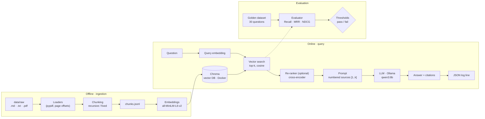
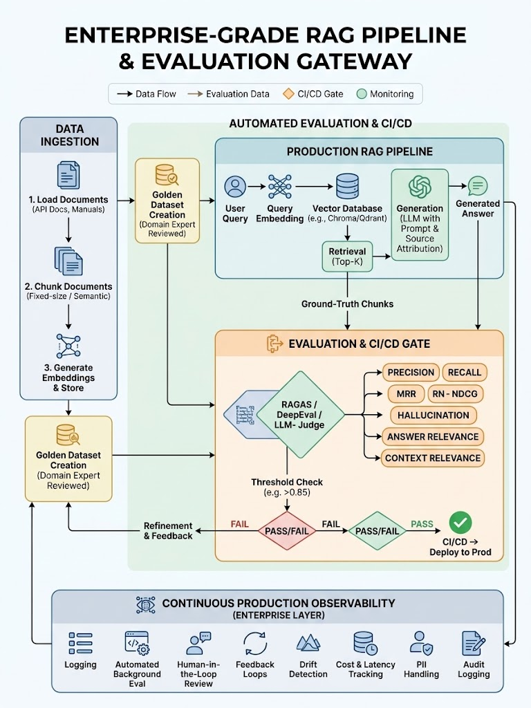

# RAG Eval Platform

[](https://github.com/mjunedalam/rag-eval-platform/actions/workflows/ci.yml)


An end-to-end **Retrieval-Augmented Generation (RAG)** system where **evaluation is part of the system, not an afterthought**. Documents are ingested, chunked, embedded and stored in a vector database; questions are answered by a local open-source LLM with **numbered citations** to the source passages; and every change to chunking, embeddings, retrieval or prompts is **scored against a golden dataset** so quality regressions are caught before they ship.

It runs **fully locally and for free**: embeddings with Sentence Transformers, vectors in Chroma (Docker), and answers from `qwen3:8b` via Ollama. No API key is required.

```text
$ uv run python scripts/ask.py "Why should the judge model be pinned?"

The judge model should be pinned to ensure consistency in scoring, as changing the model
version or prompt can alter scores and require establishing a new baseline [2].

Sources:
  [1] llm_as_judge.md  (score 0.62)
  [2] llm_as_judge.md  (score 0.42)  cited
  [3] llm_as_judge.md  (score 0.39)
  [4] rag_overview.md  (score 0.23)
  [5] ci_evaluation_gates.md  (score 0.22)

qwen3:8b · 1.9 s · 666 -> 33 tokens
```

---

## Contents

- [Why this project](#why-this-project)
- [Status](#status)
- [Architecture](#architecture)
- [Technology and tools](#technology-and-tools)
- [Results so far](#results-so-far)
- [Getting started](#getting-started)
- [Configuration](#configuration)
- [Testing and CI](#testing-and-ci)
- [Project structure](#project-structure)
- [Documentation](#documentation)

---

## Why this project

Most RAG demos stop at "it answered". In production the hard questions are different: *Did we retrieve the right passages? Is the answer supported by them? Did this change make things better or worse?* This project answers those with numbers, in three layers:

| Layer | Question it answers | Metrics |
|---|---|---|
| **Retrieval** | Did we fetch the right information? | Precision@k, Recall@k, MRR, NDCG@k |
| **Generation** | Is the answer correct and grounded in what was fetched? | Faithfulness, hallucination rate, answer relevance, citation validity |
| **Production observability** | Is it still performing well over time? | Structured query logs, background evaluation, feedback loops, drift detection |

---

## Status

| Phase | Scope | Status |
|---|---|---|
| 0 · Setup | uv, typed settings, JSON logging, lint/type/test tooling, CI | ✅ Done |
| 1 · Ingestion | Markdown / text / **PDF** loaders, recursive and fixed-size chunking, embeddings | ✅ Done |
| 2 · Retrieval | Chroma in Docker, retriever, cross-encoder re-ranking, **retrieval evaluation against thresholds** | ✅ Done |
| 3 · Generation | Local LLM via Ollama, cited answers, refusal, end-to-end pipeline, **Streamlit playground** | ✅ Done |
| 4 · Generation evaluation | RAGAS / DeepEval, LLM-as-a-judge, faithfulness and citation validity | 🔜 Next |
| 5 · CI/CD evaluation gate | Block merges when golden-set scores regress | Planned |
| 6 · API and deployment | FastAPI (`/health`, `/query`), Docker image | Planned |
| 7 · Observability | Dashboard of scores, latency and cost over time | Planned |
| 8 · Security and governance | PII masking, retrieval-time access control, audit logging | Planned |

---

## Architecture

### Current system (phases 0–3)



**Offline**: documents are loaded (PDFs keep page offsets so every chunk knows its page), split into chunks, embedded, and stored in Chroma. `chunks.jsonl` is the hand-off between the two steps, so re-embedding never requires re-reading PDFs.

**Online**: the question is embedded with the *same* model, the nearest chunks are retrieved (optionally re-ranked by a cross-encoder), shown to the LLM as numbered sources, and the answer's `[n]` citations are mapped back to the exact chunk, document and page. Citations to non-existent sources are flagged; if the sources don't contain the answer, the model must refuse instead of guessing.

**Evaluation**: 30 curated golden questions run through the retriever; scores are averaged overall and per question type and compared with thresholds from configuration (exit code `0` pass, `1` below threshold, `2` could not run).

### Design principles

- **Pluggable backends behind interfaces.** Embedder, vector store, re-ranker and LLM client are `Protocol`s, so Chroma ↔ Qdrant or Ollama ↔ OpenAI swap without touching business logic, and unit tests use fakes.
- **Configuration, not code.** Chunk sizes, top-k, models and every evaluation threshold come from typed settings (`RAG_*` environment variables / `.env`).
- **Traceable answers.** Numbered sources and `[n]` citations tie every claim to a chunk; the prompt is versioned so scores are reproducible.
- **Fail loudly, with the fix.** Invalid data, missing services or packages raise clear errors that say what to run.
- **Document-level relevance.** The golden dataset labels relevant *documents*, so it stays valid when chunking changes.

### Target architecture

The full design, including the evaluation gate and the production observability layer still to be built:



Details: [docs/architecture.md](docs/architecture.md) · [docs/evaluation_methodology.md](docs/evaluation_methodology.md)

---

## Technology and tools

| Area | In use | Planned |
|---|---|---|
| **Language & packaging** | Python 3.12, [uv](https://docs.astral.sh/uv/), hatchling (`src/` layout) | |
| **Configuration & logging** | pydantic-settings (typed, validated, secrets as `SecretStr`), JSON-lines logging | |
| **Ingestion** | pypdf + fontTools (PDF text + page offsets), LangChain `langchain-text-splitters` (recursive chunking) | Semantic chunking, tiktoken |
| **Embeddings** | Sentence Transformers `all-MiniLM-L6-v2` (local, default), OpenAI embeddings (optional) | |
| **Vector database** | Chroma 1.5 as a server in Docker (`chromadb-client`), cosine / HNSW | Qdrant (production) |
| **Re-ranking** | Sentence Transformers cross-encoder `ms-marco-MiniLM-L-6-v2` | |
| **LLM** | Ollama + `qwen3:8b` (local, open-source), OpenAI-compatible client (also works with OpenAI), streaming answers | Anthropic Claude (optional hosted) |
| **Evaluation** | Golden dataset (JSON), custom retrieval metrics (Precision, Recall, MRR, NDCG), threshold checks | RAGAS, DeepEval, LLM-as-a-judge, TruLens |
| **UI & exploration** | Streamlit playground, JupyterLab notebook + pandas, chromadb-admin web UI | Streamlit observability dashboard |
| **Quality** | Pytest (unit + integration), pytest-cov, Ruff (lint + format), mypy (strict) | |
| **CI/CD** | GitHub Actions: lint, types, unit tests, integration tests against a Chroma service container, gitleaks secret scan | Evaluation gate workflow |
| **Infrastructure** | Docker Compose (Chroma, optional admin UI) | FastAPI + Uvicorn, API Docker image |
| **Security** | Secrets only in git-ignored `.env`, pre-commit and CI secret scanning, prompt-injection guard in the system prompt | Presidio PII masking, access control, audit logs |

Full per-phase list with status: [Tooling by phase](docs/architecture.md#tooling-by-phase).

---

## Results so far

**Retrieval baseline** — 30 golden questions, top-k = 5, `all-MiniLM-L6-v2`, recursive chunks of 800 characters:

| Slice | n | Recall@5 | MRR | NDCG@5 |
|---|---|---|---|---|
| **Overall** | 30 | **0.933** | **0.878** | **0.876** |
| short | 16 | 1.000 | 0.896 | 0.923 |
| paraphrase | 8 | 1.000 | 0.938 | 0.954 |
| multi_hop | 6 | 0.667 | 0.750 | 0.646 |

All thresholds pass (Recall ≥ 0.80, MRR ≥ 0.70, NDCG ≥ 0.70). **Re-ranking** lifts multi-hop recall from 0.667 to **0.917** (overall MRR 0.878 → 0.928) at the cost of one short question — a trade-off the evaluation makes visible.

**Generation with `qwen3:8b`** on the same 30 questions: every answer cited its sources (30/30), no citation pointed to a non-existent source (0/30), no wrongful refusals, and 27/30 cited a document the golden set marks as correct; median 5.4 s per answer on an M3 Pro. Grading *faithfulness* and *citation validity* is Phase 4.

---

## Getting started

### Prerequisites

| Tool | Why | Install |
|---|---|---|
| [uv](https://docs.astral.sh/uv/) | Python and dependencies (installs Python 3.12 itself) | `curl -LsSf https://astral.sh/uv/install.sh \| sh` |
| [Docker Desktop](https://docs.docker.com/get-docker/) | Runs the Chroma vector database | Docker website |
| [Ollama](https://ollama.com) | Runs the local LLM (use the native app on macOS so it can use the GPU) | Ollama website, or `brew install ollama` |

About 8 GB of free disk space is needed for the models (PyTorch, embedding and re-ranking models, and `qwen3:8b`).

### 1. Install

```bash
git clone https://github.com/mjunedalam/rag-eval-platform.git
cd rag-eval-platform
uv sync --all-extras --all-groups     # project + models + playground + notebook
cp .env.example .env                  # optional: override settings (never commit .env)
```

### 2. Start the services

```bash
docker compose -f docker/docker-compose.yml up -d    # Chroma on localhost:8001
ollama pull qwen3:8b                                  # local LLM, ~5 GB (Ollama app must be running)
```

### 3. Build the index and evaluate retrieval

```bash
uv run python scripts/run_ingestion.py       # data/raw -> data/processed/chunks.jsonl
uv run python scripts/seed_vector_store.py   # embed the chunks into Chroma
uv run python scripts/run_evaluation.py      # golden-set scores vs thresholds
```

The first run downloads the embedding model from Hugging Face.

### 4. Ask questions

**From the terminal:**

```bash
uv run python scripts/ask.py "What does MRR measure?"
```

**In the playground** — upload your own PDFs and see every step:

```bash
uv run streamlit run src/rag_eval_platform/playground/app.py    # http://localhost:8501
```

Upload PDFs, Markdown or text files, adjust chunking, retrieval and generation settings in the sidebar, build the index, and ask in a chat: answers **stream in as the model writes them**. Each answer shows the retrieved chunks with scores, which were cited, the ranking before and after re-ranking, token counts, timings and the exact prompt sent to the model. Uploads stay local in `data/playground/` (git-ignored) and in their own Chroma collection, so the evaluation corpus is never affected.

### 5. Explore the data (optional)

```bash
docker compose -f docker/docker-compose.yml --profile ui up -d   # chromadb-admin: http://localhost:3001
uv run --group notebook jupyter lab                              # notebooks/exploration.ipynb
```

In chromadb-admin, connect to `http://chroma:8000` to browse chunks and metadata. The notebook asks questions, lists retrieval misses, and compares scores with and without re-ranking. In VS Code, select the project's `.venv` kernel.

### Stop everything

```bash
docker compose -f docker/docker-compose.yml --profile ui down    # data is kept in a Docker volume
```

---

## Configuration

All settings have defaults and can be overridden with environment variables or `.env` (see [.env.example](.env.example) and [settings.py](src/rag_eval_platform/config/settings.py)).

| Setting | Default | Meaning |
|---|---|---|
| `RAG_CHUNK_STRATEGY` / `RAG_CHUNK_SIZE` / `RAG_CHUNK_OVERLAP` | `recursive` / `800` / `100` | How documents are split (characters) |
| `RAG_EMBEDDING_MODEL` | `sentence-transformers/all-MiniLM-L6-v2` | Embedding model |
| `RAG_CHROMA_HOST` / `RAG_CHROMA_PORT` | `localhost` / `8001` | Chroma server |
| `RAG_TOP_K` | `5` | Chunks given to the LLM |
| `RAG_RERANK` / `RAG_RERANK_CANDIDATES` | `false` / `20` | Cross-encoder re-ranking |
| `RAG_LLM_PROVIDER` / `RAG_LLM_MODEL` | `ollama` / `qwen3:8b` | LLM (`openai` also supported) |
| `RAG_LLM_REASONING_EFFORT` | `none` | Hidden "thinking" for reasoning models (`none` is ~4× faster) |
| `RAG_LLM_TEMPERATURE` | `0.0` | Randomness (0 = repeatable answers) |
| `RAG_MIN_RECALL_AT_K` / `RAG_MIN_MRR` / `RAG_MIN_NDCG_AT_K` | `0.80` / `0.70` / `0.70` | Evaluation pass marks |
| `OPENAI_API_KEY` | — | Only needed for OpenAI embeddings or LLM |

Example: `RAG_RERANK=true RAG_TOP_K=3 uv run python scripts/run_evaluation.py`

---

## Testing and CI

```bash
uv run pytest tests/unit                        # fast, uses fakes: no Docker, models or Ollama needed
uv run pytest -m integration                    # real Chroma, models and Ollama (skip if unavailable)
uv run pytest --cov                             # coverage
uv run ruff check . && uv run ruff format --check .
uv run mypy src tests                           # strict type checking
```

Unit tests replace Chroma, the models and the LLM with small fakes that satisfy the same interfaces, so they run in seconds anywhere. Integration tests exercise the real tools — including a full flow from an uploaded PDF to a page-cited answer — and skip politely when a tool isn't running.

GitHub Actions runs on every push and pull request:

| Job | Checks |
|---|---|
| Lint, type-check and test | Ruff, Ruff format, mypy (strict), unit tests with coverage |
| Integration tests | Tests against a real Chroma service container |
| Secret scan | gitleaks over the full history |

---

## Project structure

```text
rag-eval-platform/
├── src/rag_eval_platform/
│   ├── config/          settings (pydantic-settings) and JSON logging
│   ├── ingestion/       loaders (md/txt/pdf), chunking, chunk storage, embeddings
│   ├── retrieval/       Chroma vector store, re-ranker, retriever, seeding
│   ├── generation/      prompt templates, LLM client, citation mapping
│   ├── evaluation/      golden dataset, retrieval metrics, evaluator
│   ├── playground/      Streamlit app (core.py logic, app.py UI)
│   ├── pipeline.py      question -> retrieve -> generate -> answer
│   └── ask.py           terminal command
├── scripts/             run_ingestion · seed_vector_store · run_evaluation · ask
├── data/
│   ├── raw/             14-document sample corpus (RAG and LLM evaluation)
│   ├── golden_dataset/  qa_pairs.json: 30 curated questions
│   └── processed/       generated chunks (git-ignored)
├── tests/               unit/ (fakes) and integration/ (real services)
├── notebooks/           exploration.ipynb
├── docker/              docker-compose.yml (Chroma, chromadb-admin)
├── docs/                architecture, evaluation methodology, learning guides
└── .github/workflows/   ci.yml, evaluation_gate.yml
```

---

## Documentation

| Document | Contents |
|---|---|
| [Architecture](docs/architecture.md) | Components, request flow, design decisions, tooling by phase |
| [Evaluation methodology](docs/evaluation_methodology.md) | Golden dataset, metrics, thresholds, CI gate, baseline |
| [Learning: Phase 2 — Retrieval](docs/learning/phase-2.md) | Docker, vector databases, similarity, re-ranking, evaluation — explained simply, with a code walkthrough |
| [Learning: Phase 3 — Generation](docs/learning/phase-3.md) | LLMs, prompts, citations, refusal, local models — explained simply, with a code walkthrough |
| [Enterprise guide](<docs/RAG Pipeline Evaluation - Enterprise Guide.md>) | Background on RAG evaluation in enterprise settings |

---

## Author

**Mohammad Juned Alam**, Senior AI & Software Engineer
[GitHub](https://github.com/TechHorizonsByJuned) · [LinkedIn](https://www.linkedin.com/in/moh-juned-alam-97336416b)

## License

MIT — see [LICENSE](LICENSE).
